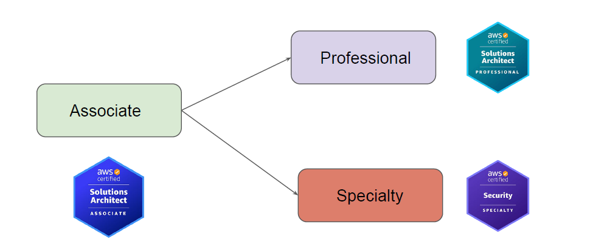

# Welcome Aboard

 AWS Solutions Architect - Associate

## Overview of the Certification

knowledge portal
AWS Solutions Architect - Associate is one of the very popular AWS certifications.
Targeted towards individuals who wants to have a solid base foundation in AWS.

## Useful documents

<https://aws.amazon.com/certification/>

<https://aws.amazon.com/certification/certified-solutions-architect-associate/>

<https://d1.awsstatic.com/onedam/marketing-channels/website/aws/en_US/certification/approved/pdfs/AWS_certification_paths.pdf?refid=e7dab476-e788-4e8c-abad-50f7a567ffad>
