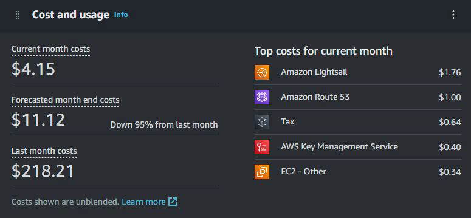
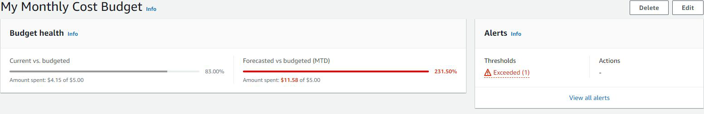
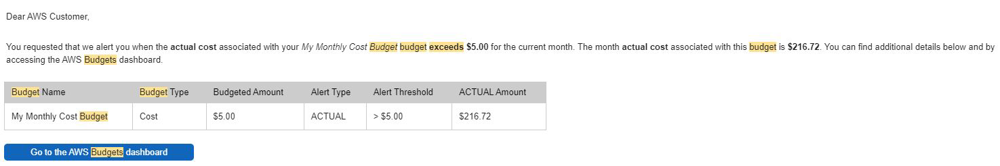

# AWS Budgets

## Understanding the Basics

AWS Account is like your credit card, use now and pay later.
You have to be careful while using AWS.

## AWS Budgets

AWS Budgets gives you the ability to set custom budgets that alert you when
your costs or usage exceed (or are forecasted to exceed) your budgeted
amount.

## Sample - AWS Budget Alert

You will receive an email alert whenever your cost exceeds Budgeted Amount.

## Points to Keep In Mind

1. Delete the resource after you have completed your practicals.

2. Set the email that you check regularly while setting up alerts.
