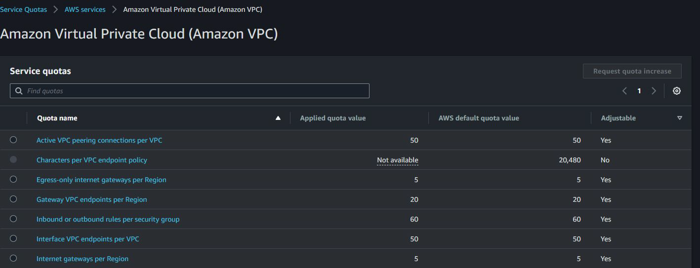

## Understanding the Basics

AWS maintains service quotas (formerly called service limits) for each account
to help guarantee the availability of AWS resources and prevent accidental
provisioning of more resources than needed.
For example, you cannot run 100 EC2 instance in a new account suddenly.

## AWS Service Quota

Each AWS service defines its quotas and establishes default values for those
quota. Depending on service, you can increase the quota value.

