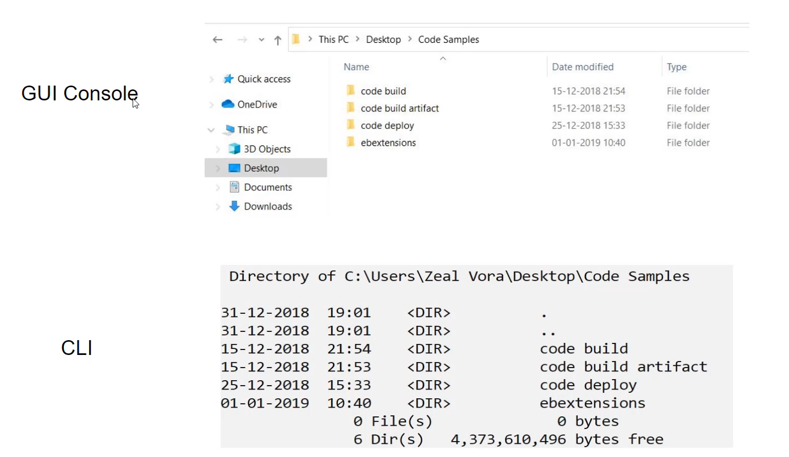
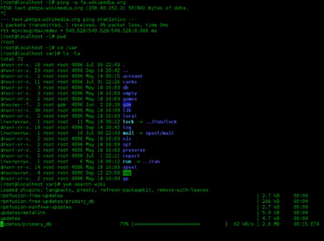
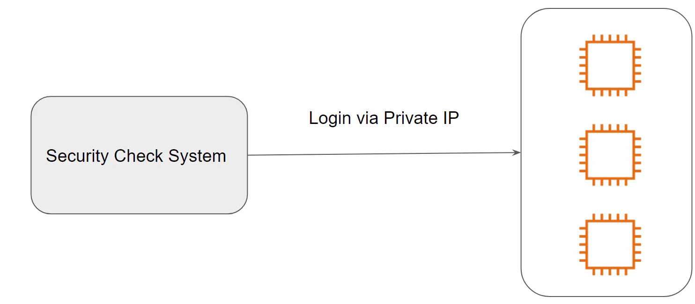
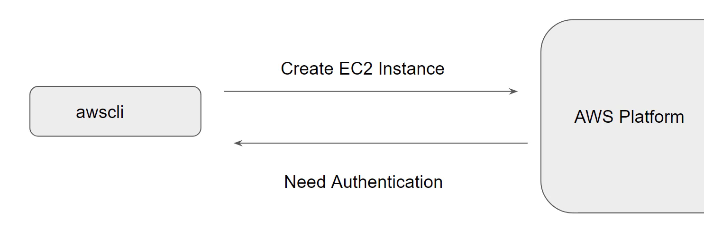

# AWS Command line Interface

## AWS CLI

- AWS CLI is used for managing AWS resources from the terminal.

- It makes room for automation & make things much more faster

## GUI and CLI

## CLI is always faster

- Comand Line Interface (CLI) is way of interacting with the system in form of commands.

- It is considered as fastest way of  doing thing in as repeated, automated fashion.

## Simple Use-Case

- A new "Security check System" verifies the security of an EC2 instance

- It evaluates the system configuration after logging into the EC2 isntance.

- It needs private IP ass an Input

## AWS CLI Pre-Requisites

There are two primary prerequisites for AWS CLI

1- AWS CLI binary
2- AWS Access Secret keys OR IAM Role

## AWS cli Documentation

There are separate set of documention avilable for AWS CLI.

These covers the list of all options that can be use while making use of AWS CLI

## AWS Command Line Interface Documentation

<https://docs.aws.amazon.com/cli/>
