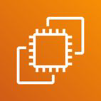
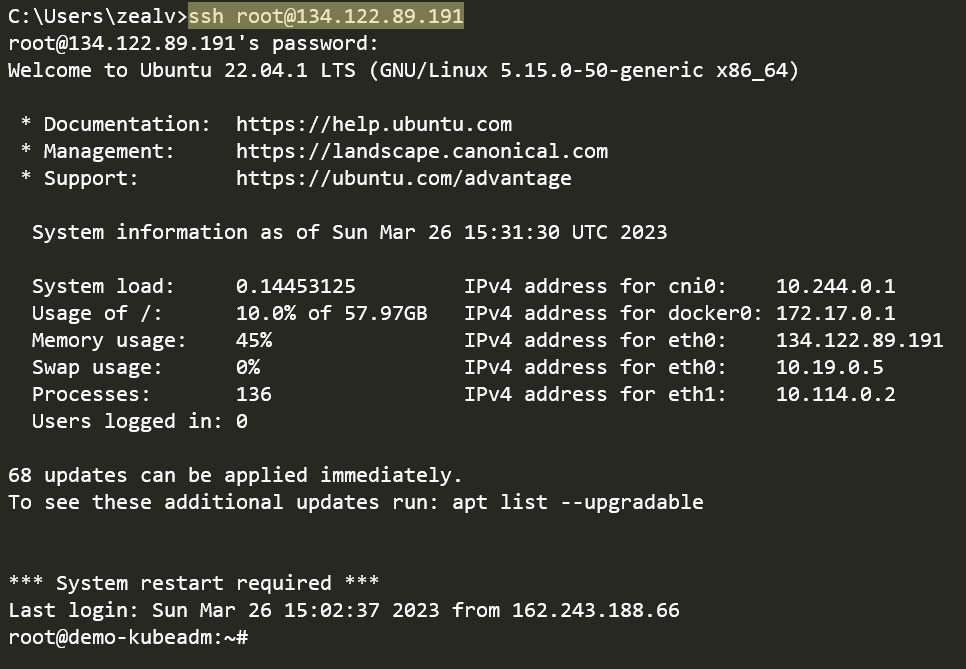
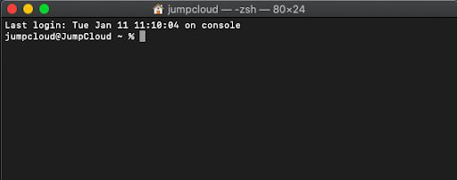
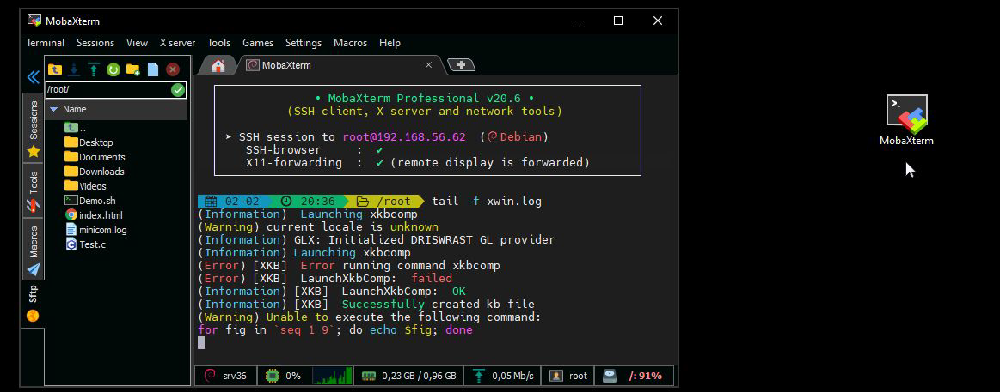

## Connecting to EC2 through SSH Client

SSH client is a utility that allows us to connect to the server through the CLI.

## SSH Client for MacOS

MacOS comes with SSH client by default.

## SSH Client for Windows

In older version of Windows, SSH Client is not present by default. You can
enable it through Optional Features.
Alternatively for Windows, you can download MobaXterm which comes with
SSH Client and other useful features.

## Point to Note

When connecting to a server using SSH client from your workstation, you will
need a password OR Private key as part of the authentication.
