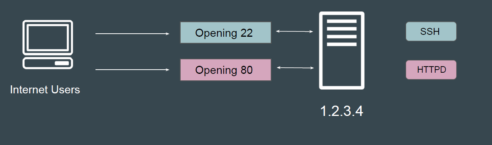
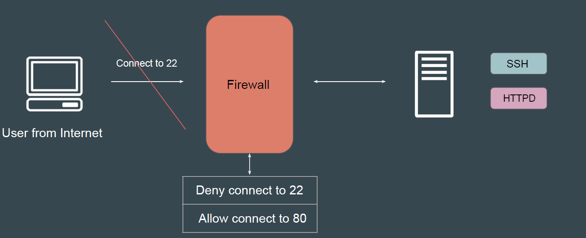
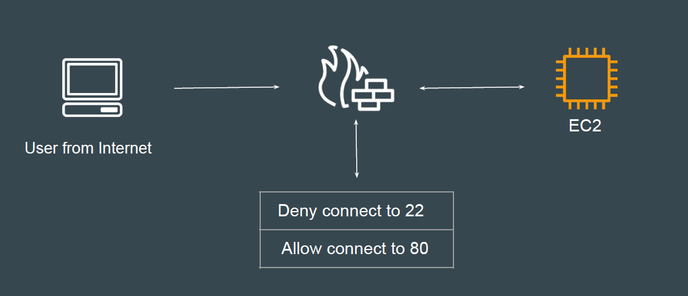
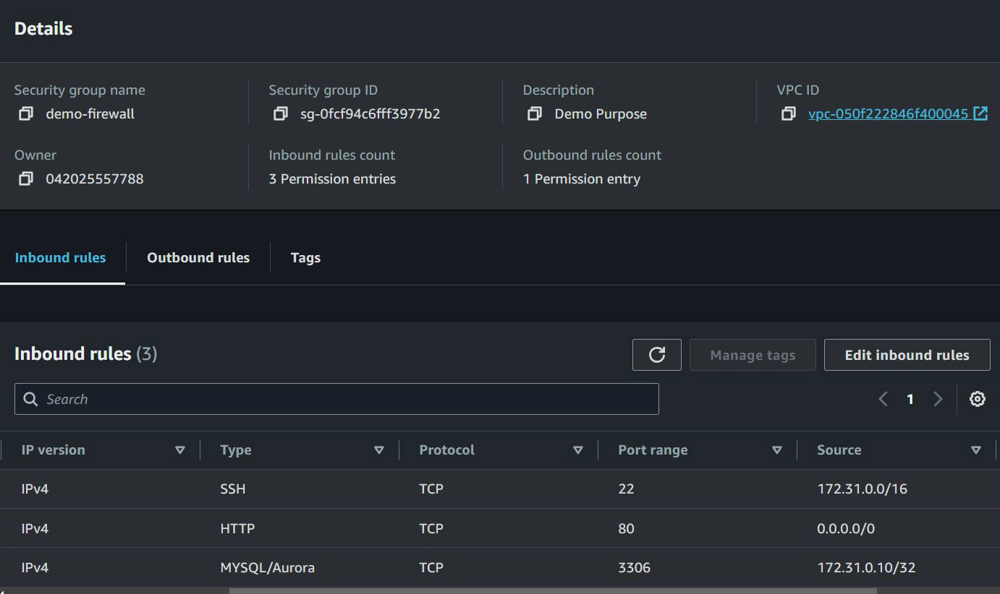
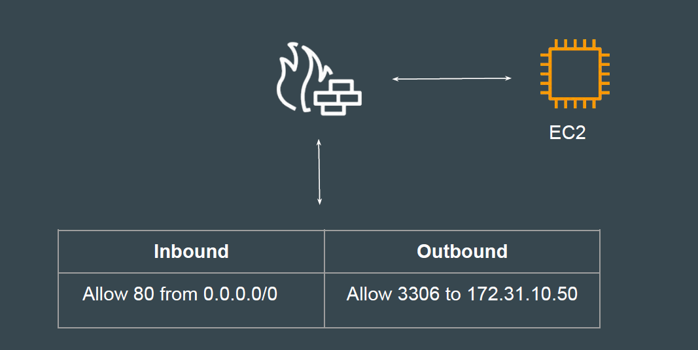

# Basics of Firewalls

## Basics of Ports

A port acts as a endpoint of communication to identify a given application or
process on an Linux operating system

## Basics of Firewall

Firewall is a network security system that monitors and controls incoming and
outgoing network traffic based on predetermined security rules.

## Firewall in AWS

A security group acts as a virtual firewall for your instance to control inbound and
outbound traffic.

## Sample Security Group with Rules

## Inbound and Outbound Rules

Firewalls control both inbound and outbound connections to and from the server.

