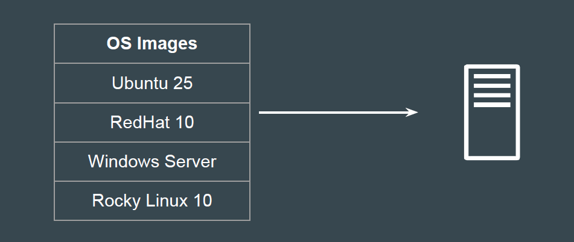
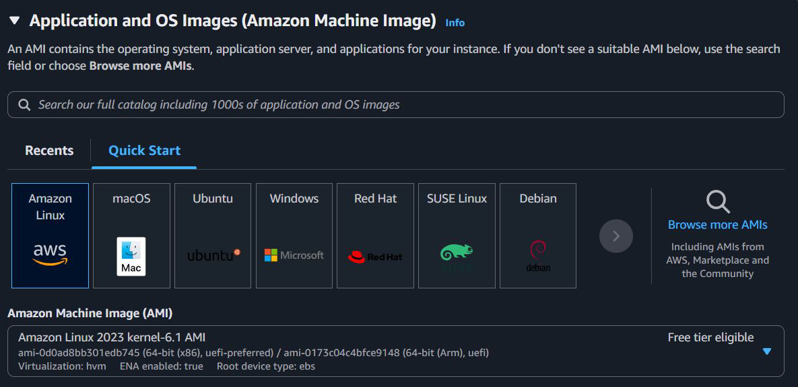
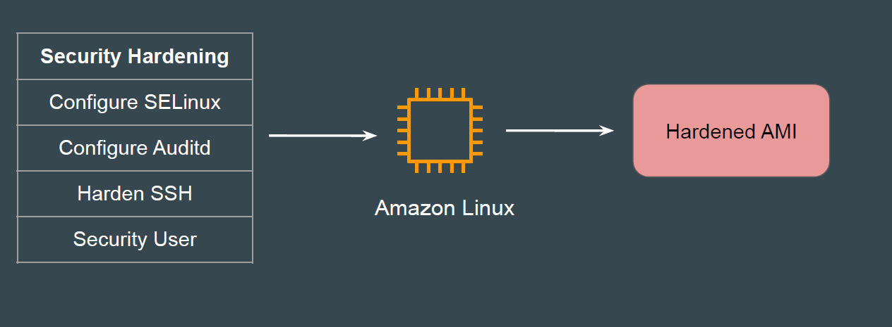
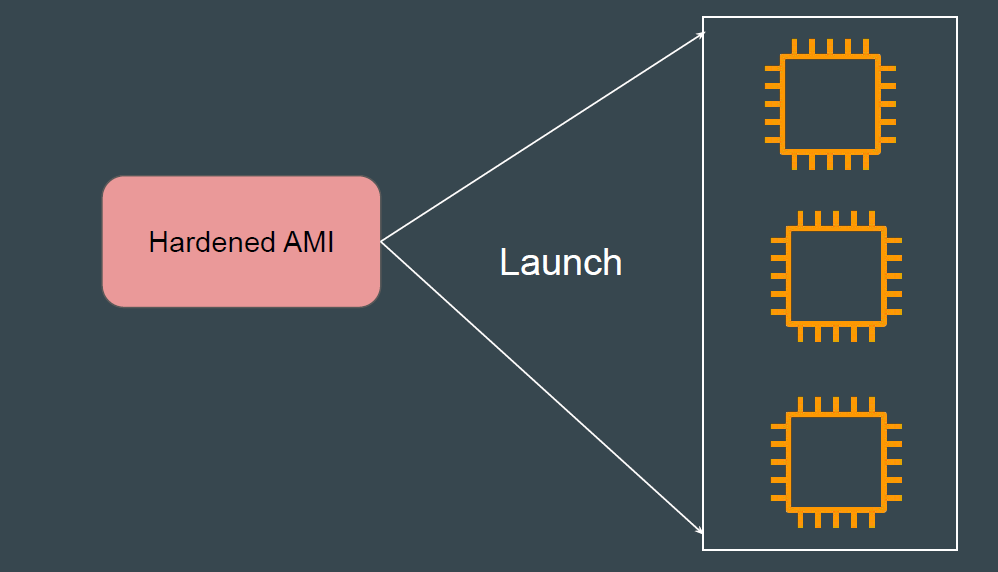

# Amazon Machine Image (AMI)

Setting the Base
Whenever you create a new server, you must decide on the operating system to
install.
Simple Analogy: Just like when you purchase a new PC, you need to install an
operating system before you can start using it.

## Amazon Machine Image

Amazon Machine Image (AMI) is primarily an operating system that you want for
your EC2 instance.

## Custom Hardened AMI

You can create your own set of custom AMIs based on specific security
hardening rules and launch EC2 instances from these hardened AMIs.

## EC2 only from Hardened AMI

Once the Security Hardened AMI is ready, all new EC2 instances can be
launched from the hardened AMI only.

## Points to Note

1. AMI’s are region-specific.

2. You can copy AMI across regions and share across AWS accounts.

3. AMIs can be Public as well as Private.
