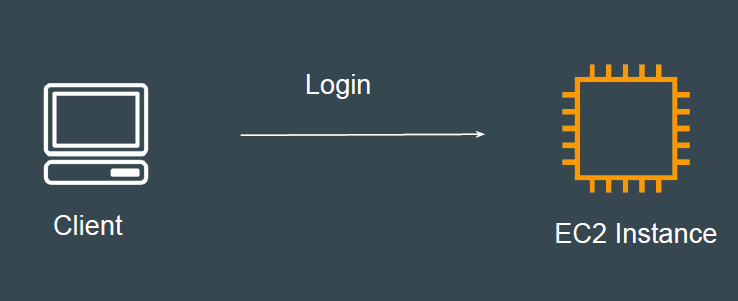
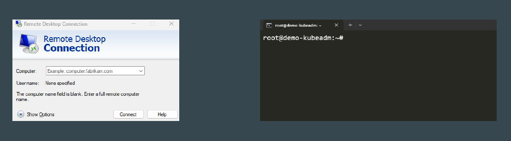

# Connectivity Options for Servers

Understanding the Base
After you have launched your EC2 instance, next important question is what will
you do with it?
Common Use-Case: Deploy a Website, Install Software

## First Important Requirement
To be able to do anything, you should FIRST connect to the server.
Similar to how we first login to our laptop before performing any operations.

## Ways to Connect to Server
Depending on the Operating System of the server, the tools to connect to it can
also change.

1. To connect to Windows server, we make use of RDP.
2. To connect to Linux server, we make use of SSH Client.

## Browser Based SSH Connection
Browser Based SSH Connection allows you to directly connect to server from
browser.
No need to maintain keys or have SSH client.

