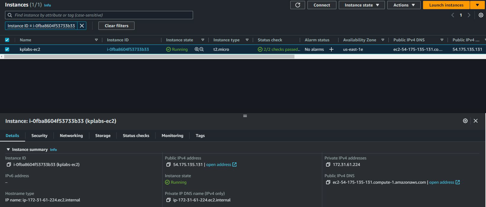
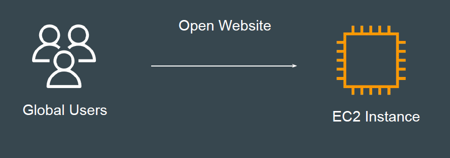

# Understanding the Base

At this stage, we have our EC2 instance running.
We are also able to login to the server using Browser Based SSH or SSH Client.

## Aim of Today’s pracice

We will be launching our first website through EC2 instance.
Users across the world should be able to open our website.

