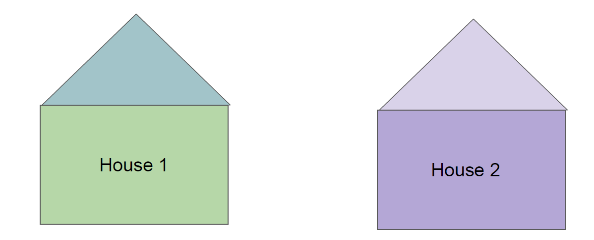
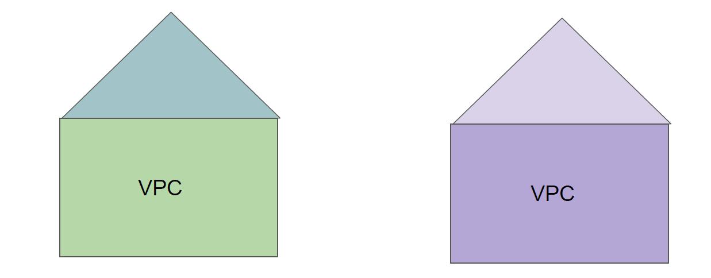
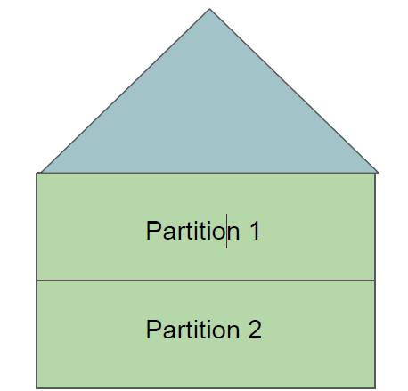
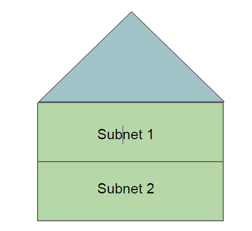
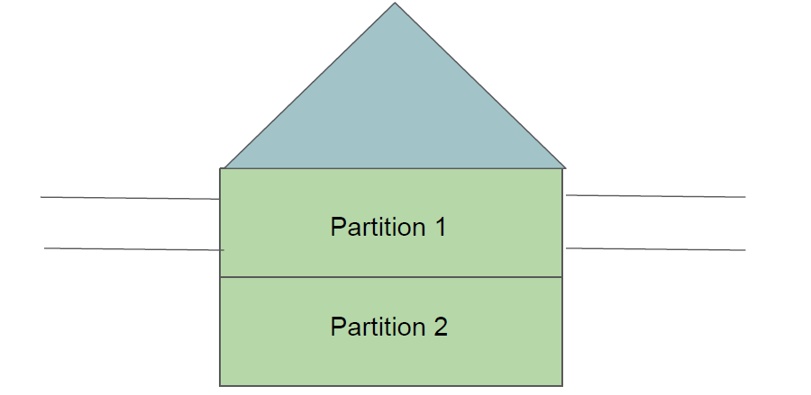
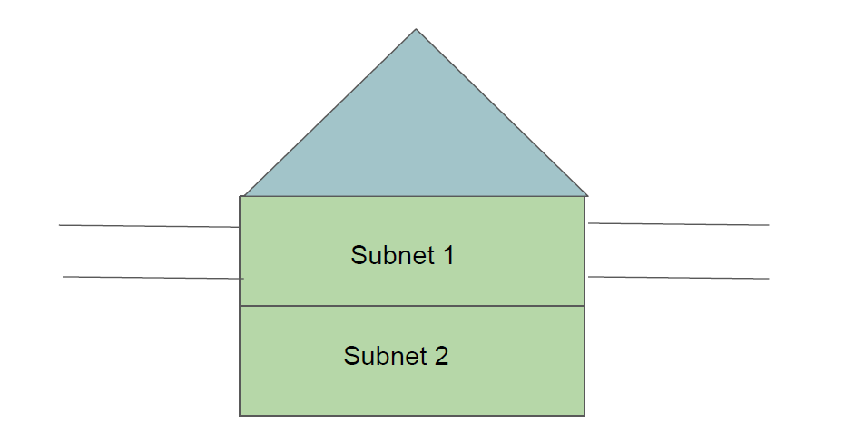
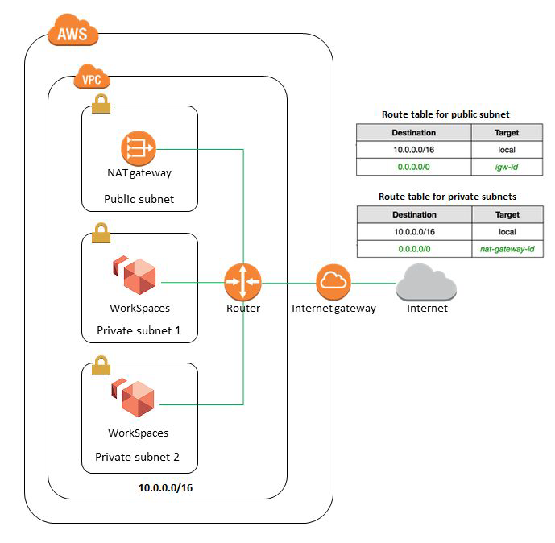

# Virtual Private Cloud

## Let’s understand with a use-case

John works as Finance manager. He is migrating to a new city because of his job and plans to live
in an apartment.

## Analogy in terms of servers

- 5 servers are planned to be migrated to cloud.

- The location where they can be launched in AWS is VPC.

## Let’s understand with a use-case

John has decided to buy a new house. For additional income, he has decided to rent part of hise
house .
John decides to partition his house.

## Let’s understand with a use-case

Among the 5 servers, we have decided following architecture:

- Launch 3 servers in first partition (subnet 1)
- Launch 2 servers in second partition (subnet 2)

John can decide to have additional layer of security in each partition.

## Additional Layer of Security - Partition Wise

John decides to build two entrance so that individuals in partition 1 can directly go out of the
house.
Hypothetically imagine that no doors for partition 2 so no one can go out.

Solutions Architect creates a route so that servers from subnet 1 can connect to the internet.
For subnet 2, no routes has been created hence servers cannot reach the internet.

## Inter-Communication

There can be a need for servers from two subnets to speak with each other.
So you can create a route that can allow communication between two subnets.

## Important Learnings

Every EC2 instance that we create should be under a VPC.
EC2 instance launched in a VPC will be protected or not protected based on configuration of VPC.
Architecture changes when you go into more technical aspect.

