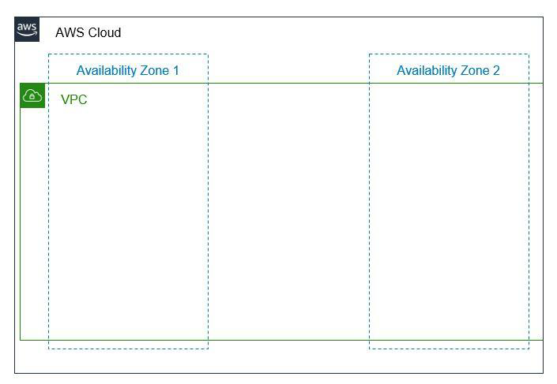
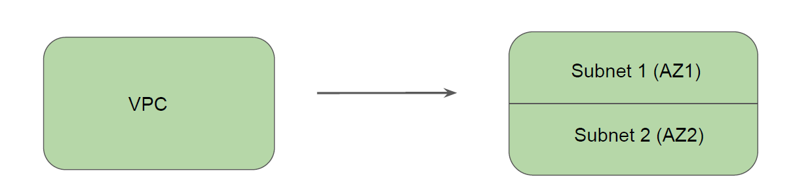
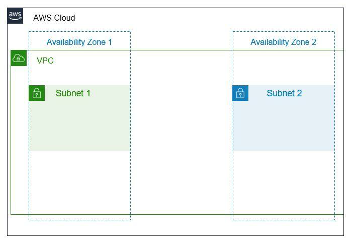

# Basics of Subnets

A VPC spans across all of the Availability Zones in the Region.
A EC2 instance can be launched in a single availability zone of your choice.

## Setting up the Base

We cannot launch EC2 instances directly in the VPC.
We divide the VPC into smaller sub-networks.
Each sub-network associated with single Availability Zone.
EC2 can be launched inside a sub-network.

## Basics of Subnets

Subnet is a subnetwork which is a subdivision of a larger network.
When you launch an EC2 instance in a subnet, the EC2 gets launched in an appropriate
availability zone that subnet is associated with.

## IP Addressing Pointer - Analogy

All the resources inside VPC will have an IP address from the VPC CIDR.
Let’s understand this with an example:
We assign one hundred number to our VPC (0-100)
Every resource in VPC will be assigned one of these numbers.
EC2 Instance 1 - Number 4
EC2 Instance 2 - Number 10

## IP Addressing Pointer - Technical

Our VPC has a CIDR of 10.77.0.0/16
Total IP Addresses: 65,536
Every resource in VPC will be assigned IP addresses from the given pool.
EC2 Instance 1 - 10.77.0.5
EC2 Instance 2 - 10.77.0.10

## Subnet CIDR - Analogy

Every subnet has its own IPv4 CIDR block that is a subset of the VPC’s CIDR block.
We assign one hundred number to our VPC (0-100)
We subdivide it based on subnets.

- Subnet 1 - Will have a range of 1-10
- Subnet 2 - Range of 11-50
- Subnet 3 - Range of 51-90

## Subnet CIDR - Technical

Every subnet has its own IPv4 CIDR block that is a subset of the VPC’s CIDR block.
Our VPC has a CIDR of 10.77.0.0/16
Total IP Addresses: 65,536
We subdivide it based on subnets.

- Subnet 1 - 10.77.1.0/24 (256 IP Addresses)
- Subnet 2 - 10.77.2.0/24 (256 IP Addresses)
- subnet 3 - 10.77.3.0/24 (256 IP Addresses)
