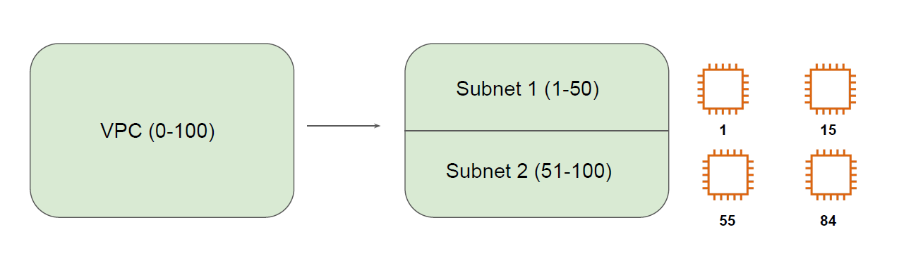
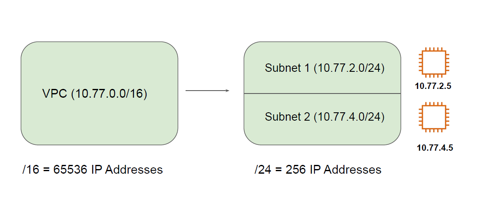
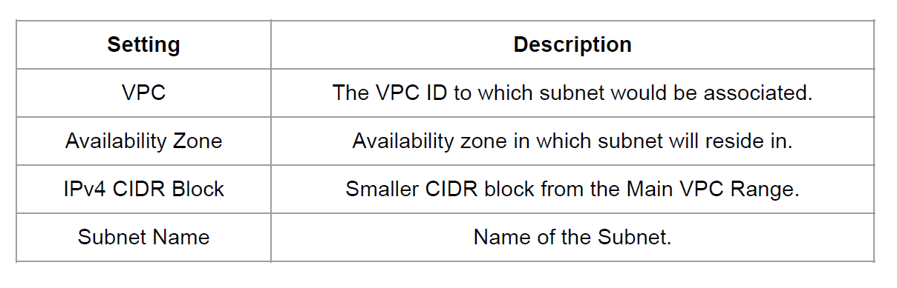
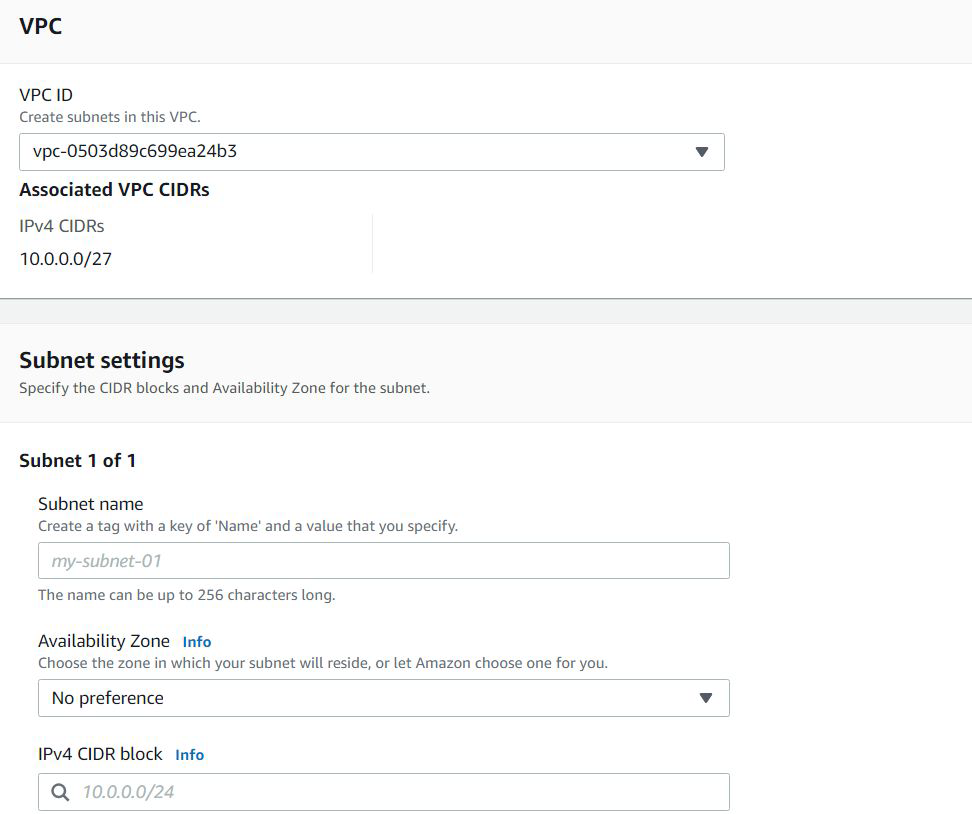

## Creating Subnetworks - Analogy

Each subnet has its own set of range that is derived from the larger VPC range.

## Creating Subnetworks - Technical

## Creating Subnet Process

When you create a subnet, following are some of the important setting that need to be
configured.

