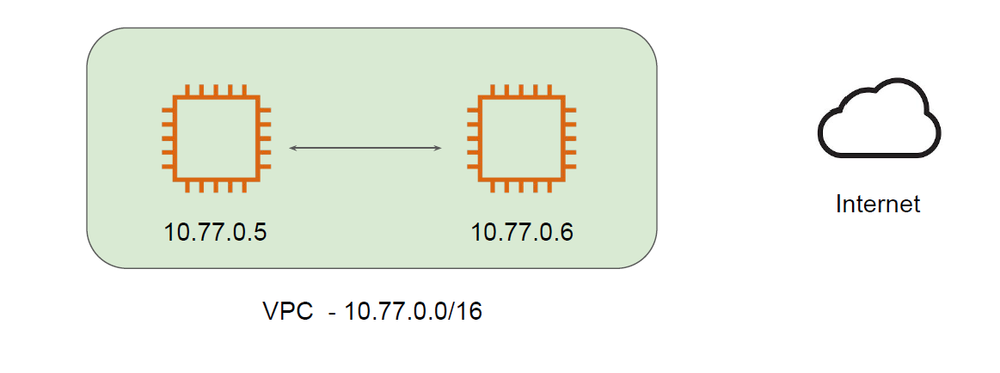
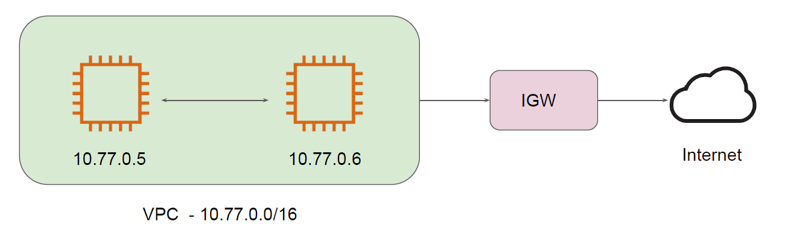

# Simple Analogy

You have recently moved to a new house.
You have a laptop and you want to watch some Youtube videos.
But there is no Internet connectivity in your house.

## VPC Network

The EC2 instances inside VPC will be able to communicate with each other.
They will NOT be able to connect to Internet.

## Internet Gateway

An internet gateway is a component that allows communication between your VPC and the
internet.
It allows both inbound as well as outbound communication.

