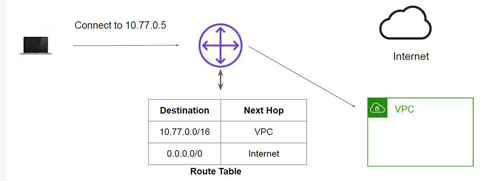
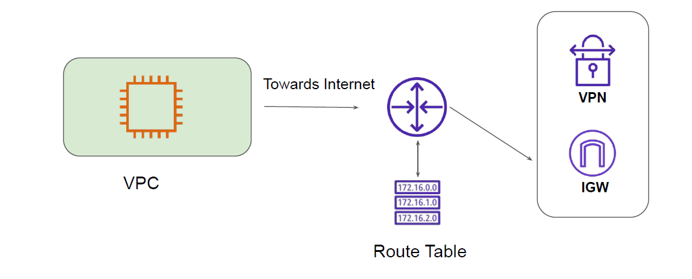
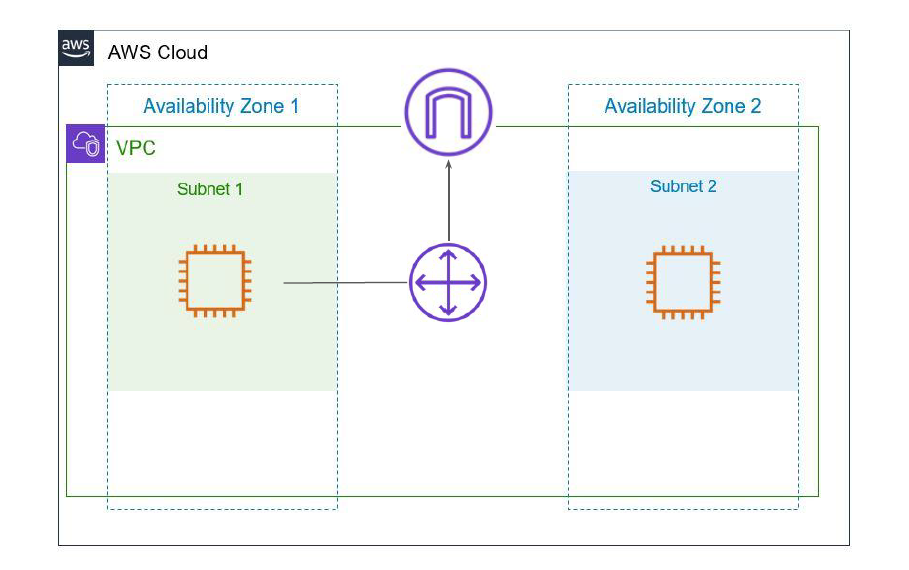
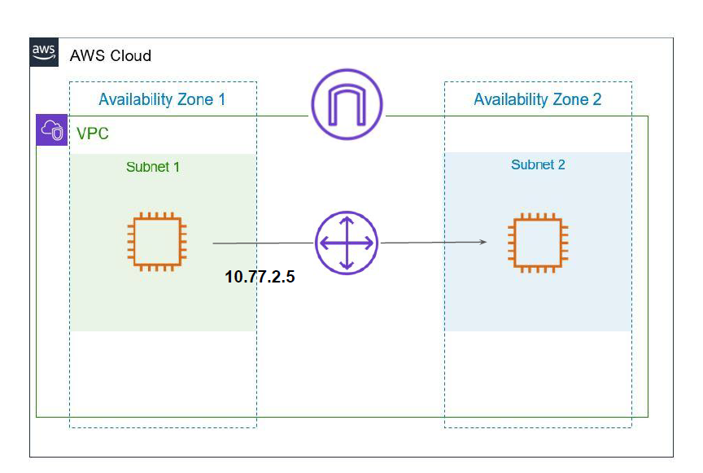
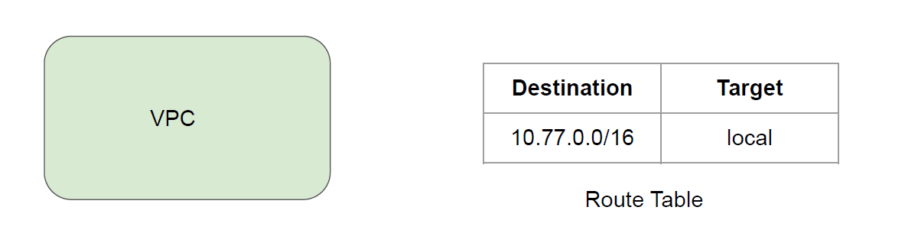
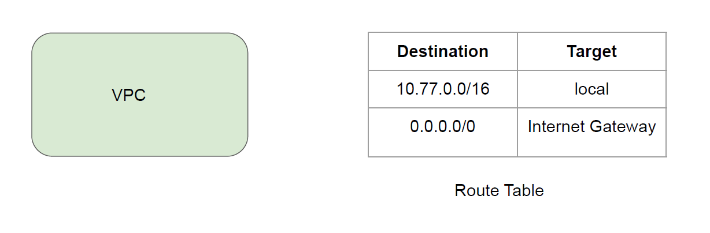

# Route Tables

Direction Billboards are very useful to determine the next turning point to reach the
destination.
A router is a networking device that forwards data packets between networks.
Each router has a route table that contains the routing rules.

## Route Table in AWS

A route table contains a set of rules, called routes, that determine where network traffic from
your subnet or gateway is directed.
By default, whenever a VPC is created, the route table is also created.

## High-Level Working - Internet Route

## High-Level Working - Local Route

## Default Route in Route Table

By default, whenever a VPC is created, the route table is also created.
The default route table has one local route configured..
This local route allows communication within VPC.

## Route Table for Internet Connectivity

If you want VPC to have connectivity towards internet, you can create appropriate Route Table
entry.

