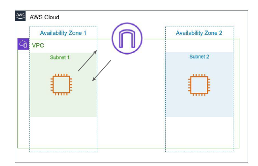
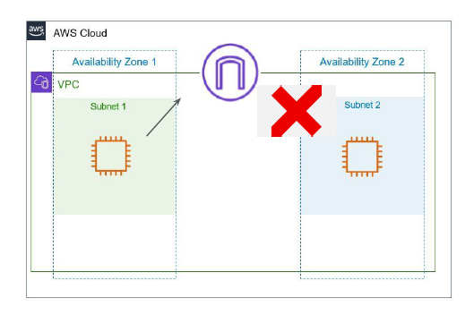
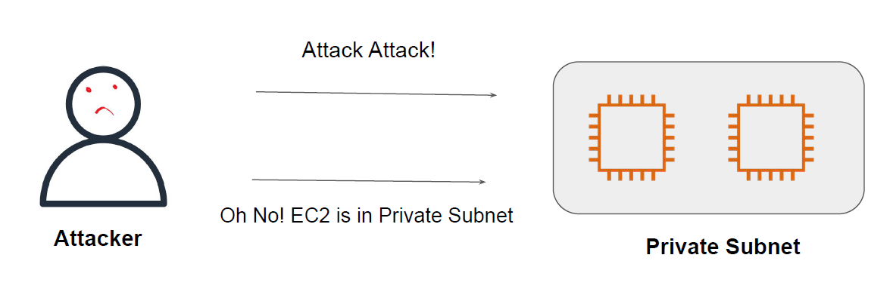
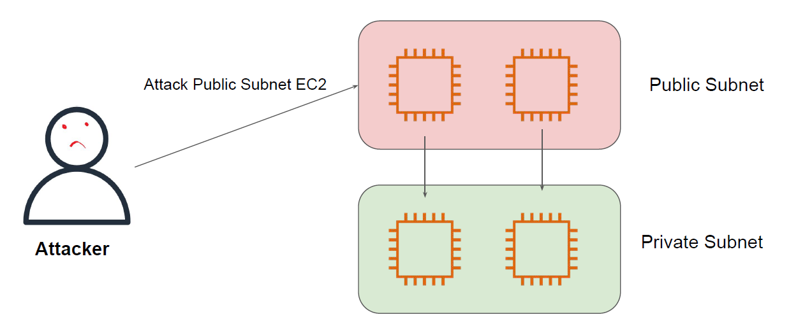
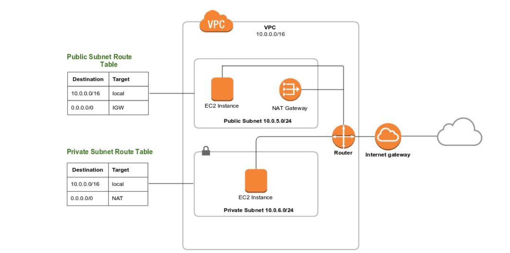
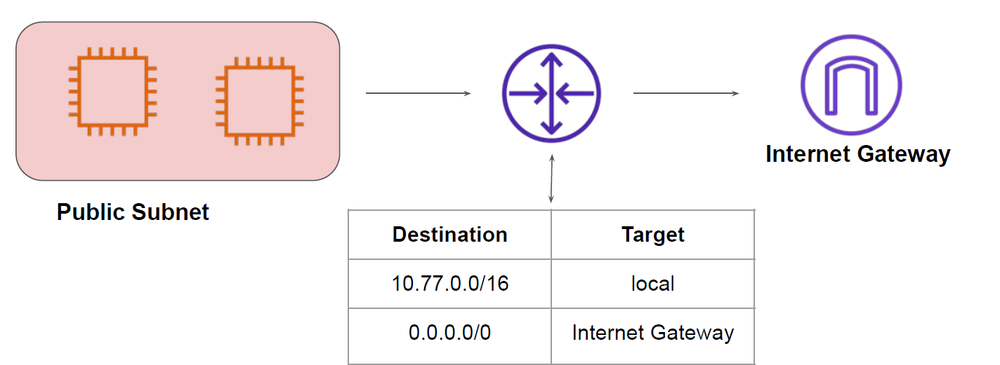
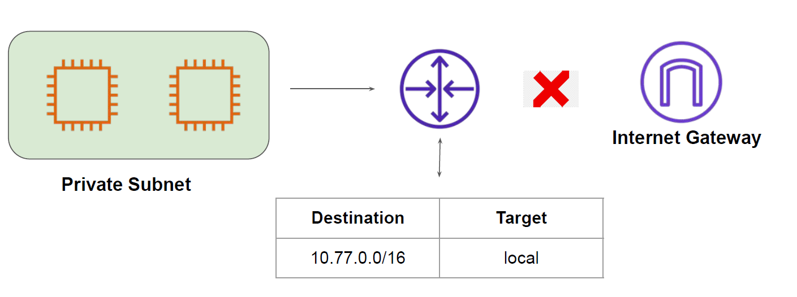
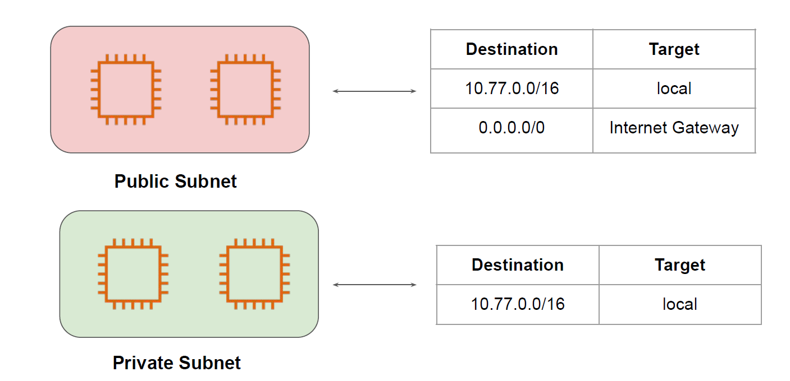

# Public and Private Subnets

## Public Subnet

Public subnet is a subnet that is associated with an Internet Gateway.
This subnet is recommended if you want to run a public-facing web application.
Overall Security Risk: High

## Private Subnet

Private subnets are the ones that do not have an Internet Gateway attached to it.
No New connections from the Internet can reach to the EC2 instances within the private
subnet.

## Benefits of Private Subnet

Since internet connectivity is not present, it is much more difficult by an attacker to attack
the system in private subnet directly.

## Important Note

Even though the EC2 instance are in private subnet, the local level communication between
EC2 in public and private will still work using private IPs.

## The Network Architecture

## Public Subnet Configuration

Following is true for Public Subnet:

1. Internet Gateway is Attached to VPC
2. Route Table has route towards Internet Gateway.

## Private Subnet Configuration

Following is true for Private Subnet:
Route Table does not have a route towards Internet Gateway.

## Steps to Configure Public and Private Subnet

There will be 2 route tables: One for Public Subnet and Second for Private Subnet.

