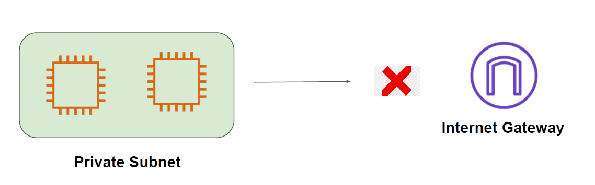
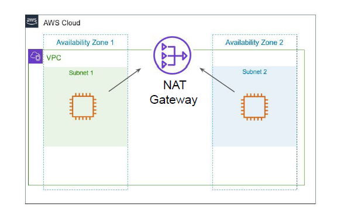
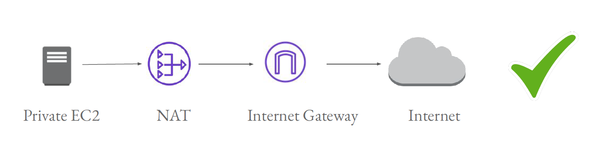
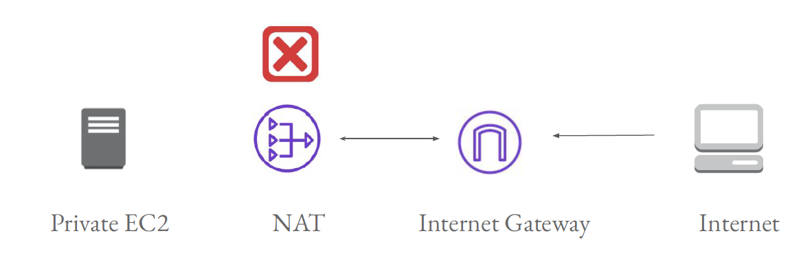

# NAT Gateway

Allow Outbound Internet Connectivity

# Challenge with Instance in Private Subnet

Since there is no Internet connectivity in Private subnet, the EC2 instance and application inside
it will not be able to perform any kind of patch updates, download new softwares etc.

## Overview of NAT Gateways

NAT Gateway allows instances in the private subnet to initiate a new connection towards the
Internet.
New connections from Internet cannot be established to instances in Private subnet.

# Working of NAT Gateway

## Example 2 - NAT Gateway

