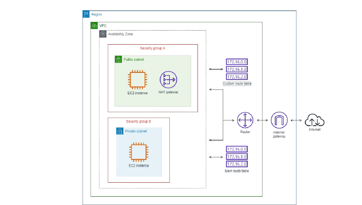
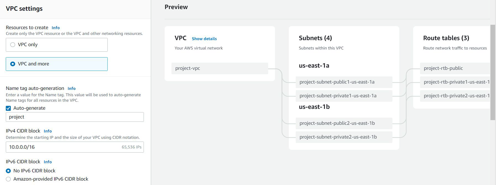

# New VPC Create Experience

"Create VPC Quickly"

## Understanding Challenge

If you want to create a new VPC setup, there are multiple components that you have to
configure:
VPC, Subnets, Route Tables, NAT Gateway, Internet Gateways

## New VPC Create Experience

AWS has released a new VPC Create Experience that allows us to quickly setup entire VPC
infrastructure with click of just few buttons.

