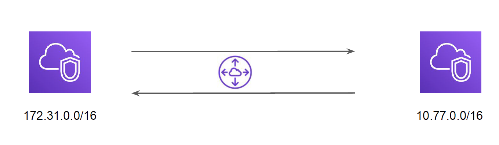
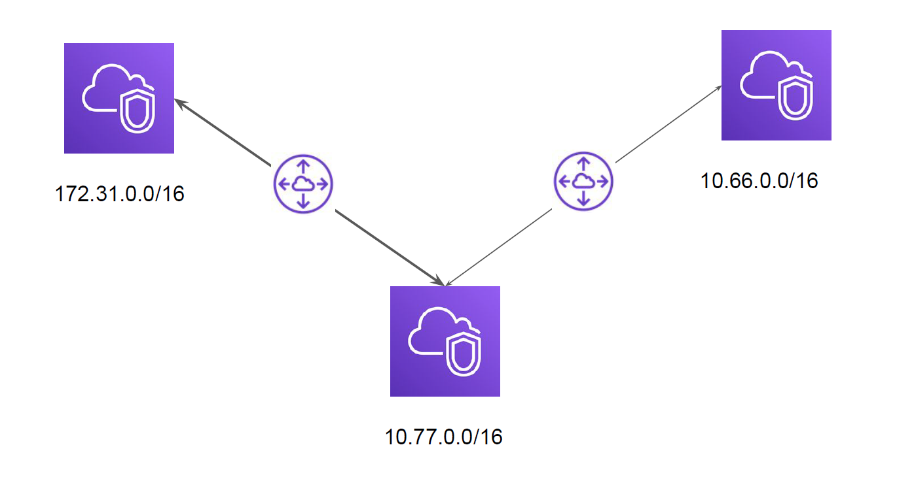
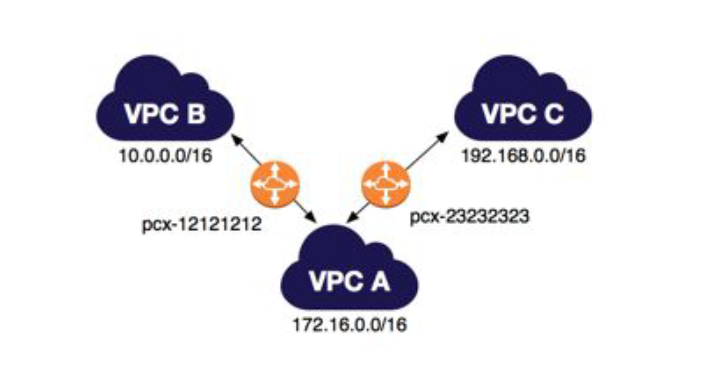
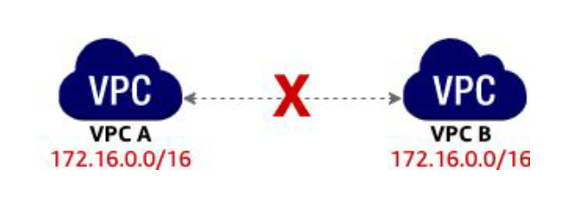
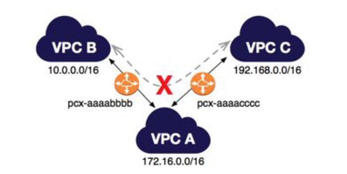

# VPC Peering

"Let’s Route"

## VPC Peering

VPC peering is a network connection between two VPC that enables the communication
between instances of both the VPC.

## Architecture - 1

- First VPC - 172.31.0.0/16
- Secondary VPC - 10.77.0.0/16

## Architecture - 2

## Things to Remember

- VPC Peering is now possible between regions.
- VPC Peering does not act like a Transit VPC

## Unsupported VPC Peering Configurations - 1

You cannot create a VPC peering connection between VPCs with matching or
overlapping IPv4 CIDR blocks.

## Unsupported VPC Peering Configurations - 2

You have a VPC peering connection between VPC A and VPC B (pcx-aaaabbbb), and
between VPC A and VPC C (pcx-aaaacccc).
There is no VPC peering connection between VPC B and VPC C. You cannot route
packets directly from VPC B to VPC C through VPC A.

