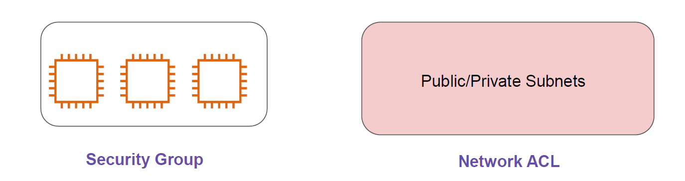
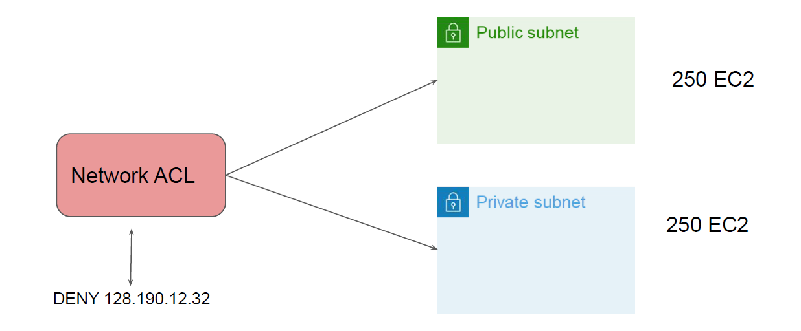

# Network ACL

"Multiple Layers for Defense"

## Understanding the Basics

A network access control list (ACL) is an optional layer of security for your VPC that acts as a
firewall for controlling traffic in and out of one or more subnets.

- Security Group works at an EC2 instance level.
- Network ACL works at a Subnet Level.

## Understanding with Use-Case

Company XYZ is getting lot of attacks from a random IP 128.190.12.32. The company has
more than 500 servers and Security team decided to block that IP in firewall for all the servers.
How to go ahead and achieve that goal ?

## Important Pointers

Each subnet in your VPC must be associated with a network ACL. If you don't explicitly
associate a subnet with a network ACL, the subnet is automatically associated with the
default network ACL.
Default NACL allows all inbound and outbound IPv4 traffic and, if applicable, IPv6 traffic.
You can associate a network ACL with multiple subnets. However, a subnet can be
associated with only one network ACL at a time.
