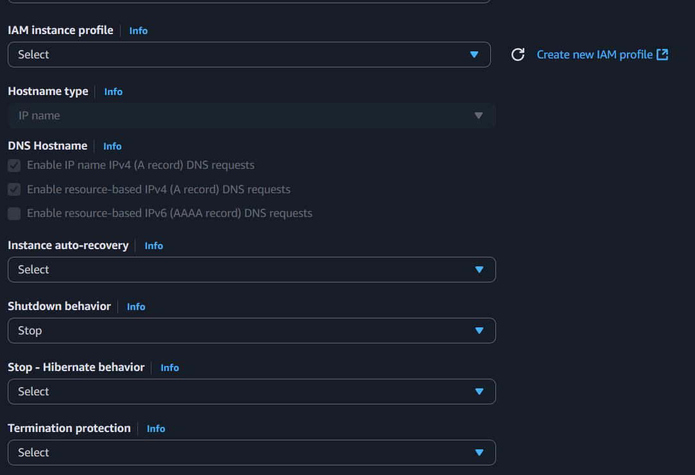
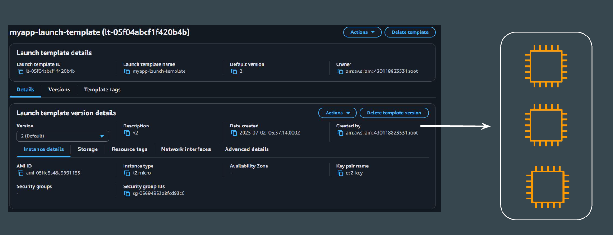
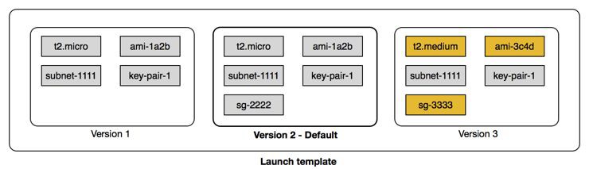

# Launch Templates

# Setting the Base

When launching an EC2 instance, you have 30–40 different settings you can
configure according to your needs.
However, most users simply use the default settings and launch the EC2
instance.

## Introduction to Launch Template

You can use an Amazon EC2 launch template to store instance launch
parameters so that you don't have to specify them every time you launch an
Amazon EC2 instance.

## Launch Template Versions

For each launch template, you can create one or more numbered launch
template versions.
Each version can have different launch parameters. When you launch an
instance from a launch template, you can use any version of the launch
template.

## Best Practise

You can control the configuration of your Amazon EC2 instances by specifying
that users can only launch instances if they use a launch template, and that they
can only use a specific launch template
