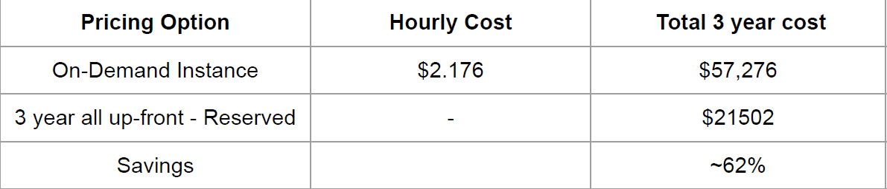
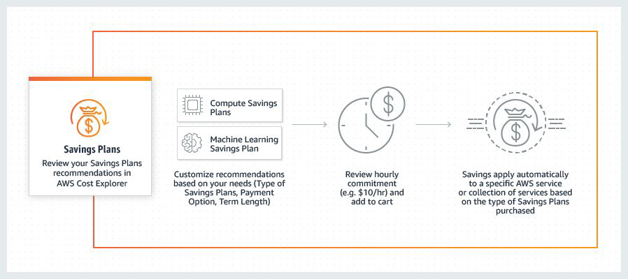

# EC2 Pricing

"Cost Optimization"

## Paying for EC2 Instances

There are fives primary ways in which we can pay for EC2 instance usage.

1. On-Demand
2. Savings Plan
3. Reserved Instances
4. Spot Instances
5. Dedicated Hosts

## On-Demand Pricing

With On-demand instances, we pay for compute capacity per hour or per second
depending on the instances which is being run.
No upfronts payments are needed and we can increase or decrease the capacity whenever it
is needed.

### On-Demand Can Lead to Unexpected Issues

Monday: 500 customers using 16GB RAM on-demand servers individually.
Wednesday: 30 customers using 16GB RAM on-demand servers individually.
A “Cloud Service Provider” will not have a clear picture on how many servers should the
provision. Too high → resources might unused and too low → money loss

## Reserved Instance

Reserved Instance provides us with significant discount (upto 75%) compared to
on-demand instance pricing.
Reserved instance are assigned to a specific availability zone and provides capacity
reservation for AWS EC2 instances.
Example :
You know you will always be running 20 servers of m4.2xlarge type of 1 year, then buy
reserved instances for them.

### Reserved Instance - Part 2

Example: g4dn.8xlarge instance type

## Spot Instance

Spot instances allows us to bid on spare Amazon EC2 computing capacity for up to 90%
of the on-demand cost.
Such instances are recommended for applications that can have flexible start and end times

## Savings Plans

Savings Plans are a flexible pricing model that offer low prices on EC2 and Fargate usage,
in exchange for a commitment to a consistent amount of usage (measured in $/hour) for a
1 or 3 year term.

## Dedicated Host

A dedicated host is a physical EC2 server dedicated for your use.
It can be purchased on-demand as well as reserved instance.

