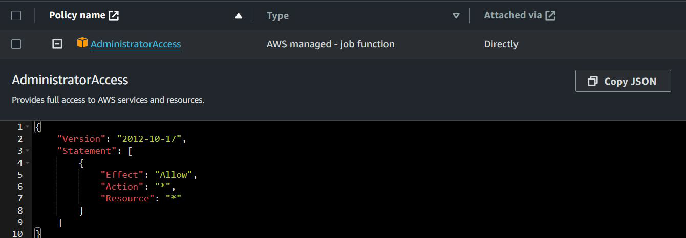
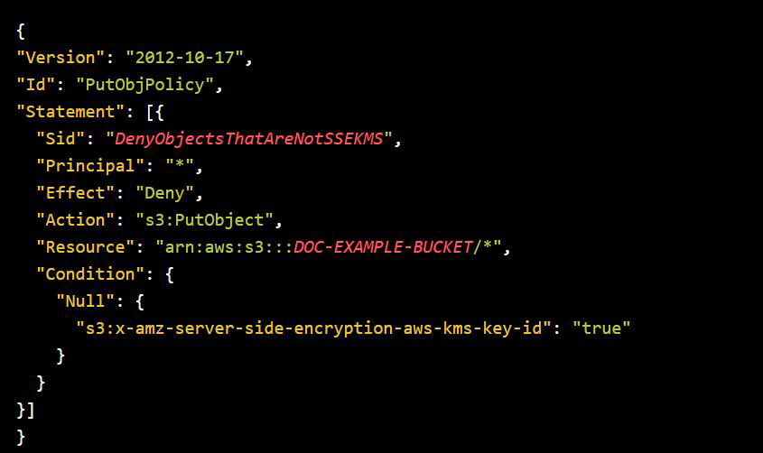
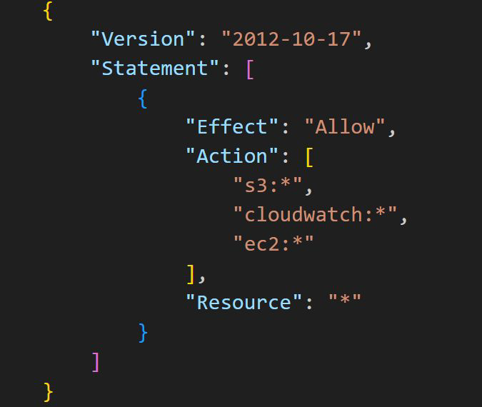
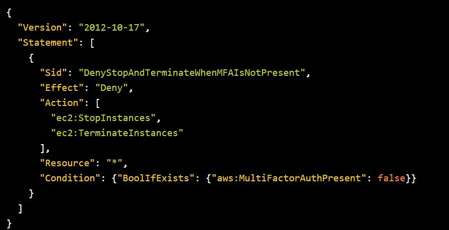
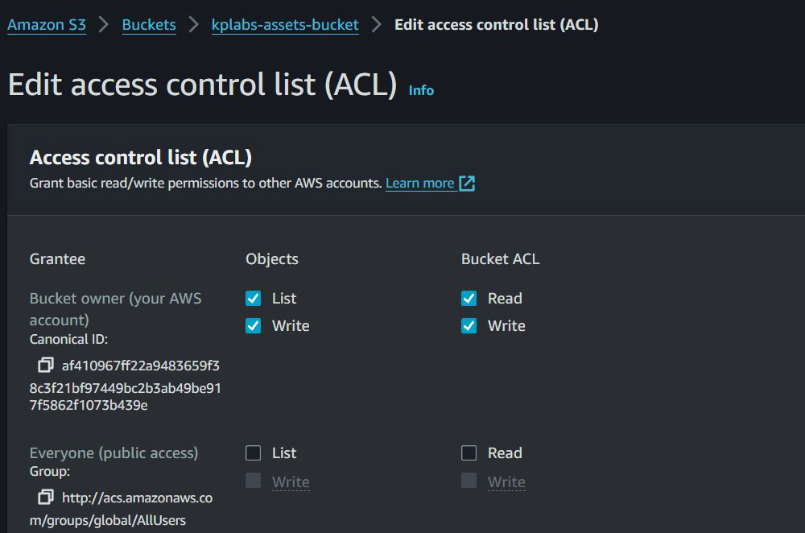

# IAM Policies

IAM Policy defines permissions that a specific entity has in AWS.

# IAM Policy Types

| IAM Policy Types            | Description                                                                 |
|----------------------------|-----------------------------------------------------------------------------|
| Identity-based policies     | Attach managed and inline policies to IAM identities (users, groups to which users belong, or roles). |
| Resource-based policies     | Attach inline policies to resources like S3, SQS, and so on.               |
| Permissions boundaries     | Defines the maximum permissions that the identity-based policies can grant to an entity, but does not grant permissions. |
| Organizations SCPs          | Define the maximum permissions for account members of an organization or organizational unit (OU). |
| Access control lists (ACLs) | Control which principals in other accounts can access the resource to which the ACL is attached. |
| Session policies           | Session policies limit permissions for a created session, but do not grant permissions. |

## Identity Based Policy

Identity-based policies are JSON permissions policy documents that control
what actions an identity (users, groups of users, and roles) can perform, on
which resources, and under what conditions

lets explor this on practical in AWS

## Resource-based policies

Resource-based policies are JSON policy documents that you attach to a
resource such as an Amazon S3 bucket, KMS Keys etc.
You can specify who has access to the resource and what actions they can
perform on it.

lets explor this on practical in AWS for S3 and SNS service.

## Permission Boundaries

A permissions boundary is an advanced feature in which you set the maximum
permissions that an identity-based policy can grant to an IAM entity

lets explor this on practical in AWS

## Service Control Policies

SCPs are JSON policies that specify the maximum permissions that can be
allowed at an account level (Organization or Organizational Unit)

## Access Control Lists

Access control lists (ACLs) are service policies that allow you to control which
principals in another account can access a resource.

lets explor this on practical in AWS for S3
