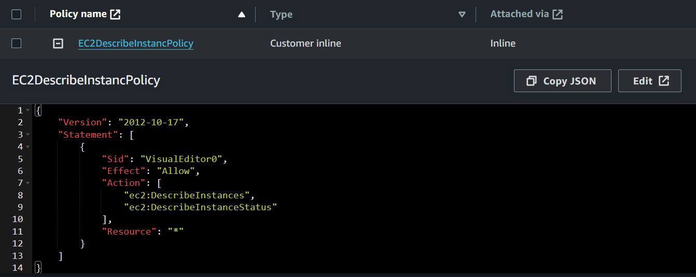
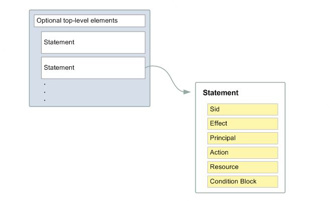
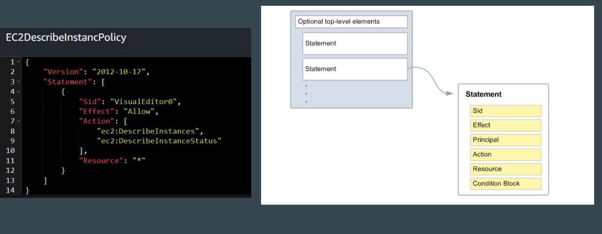
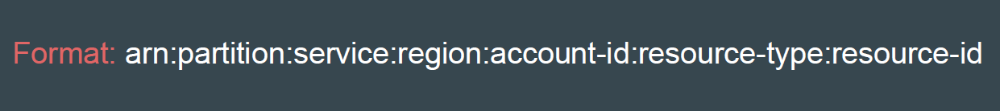
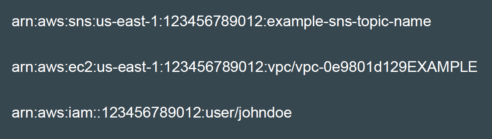
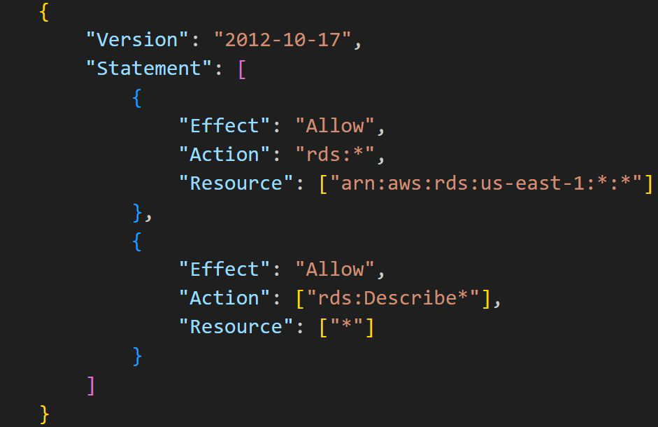
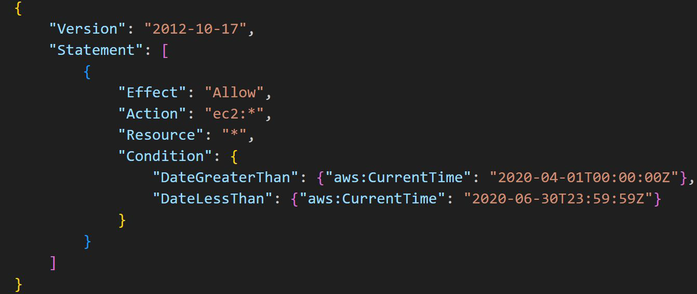
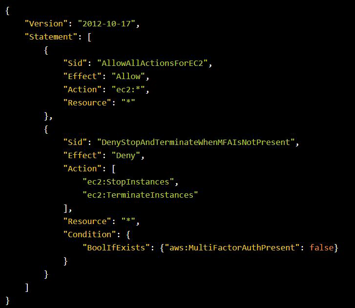

# IAM Policies - JSON policy document structure

## Understanding the Basics

It is important for us to be able to understand to read and write JSON policies
effectively

### Basic about JSON Policy

Most policies are stored in AWS as JSON documents.
These include:

- Identity-based policies
- Resource-based policies
- Service Control Policies
- Session policies

## Understanding the Basic Structure

As illustrated in the following figure, a JSON policy document includes these
elements:

## Comparison - Policy to Structure

| Elements              | Description                                                                 |
|-----------------------|-----------------------------------------------------------------------------|
| Version               | Specify the version of the policy language that you want to use. AWS recommends that you use the latest `2012-10-17` version. |
| Statement             | Use this main policy element as a container for the following elements.    |
| Sid (Optional)        | Include an optional statement ID to differentiate between your statements. |
| Effect                | Use `Allow` or `Deny` to indicate whether the policy allows or denies access. |
| Principal             | Not required for IAM policies attached to a user or role. For resource-based policies, you must specify the account, user, role, or federated user to allow or deny access. |
| Action                | Include a list of actions that the policy allows or denies.                |
| Resource              | If you create an IAM permissions policy, you must specify a list of resources to which the actions apply. |
| Condition (Optional)  | Specify the circumstances under which the policy grants permission.        |

## Importance of ARNs

Amazon Resource Names (ARNs) uniquely identify AWS resources.

### example

### Reference Policy 1

Allows full RDS database access within a specific Region

### Reference Policy 2

This policy restricts access to actions that occur between April 1, 2020 and June
30, 2020 (UTC), inclusive

### Reference Policy 3

Allow ALL actions on EC2 except Stop and Terminate IF if the user is not
authenticated using multi-factor authentication (MFA)

