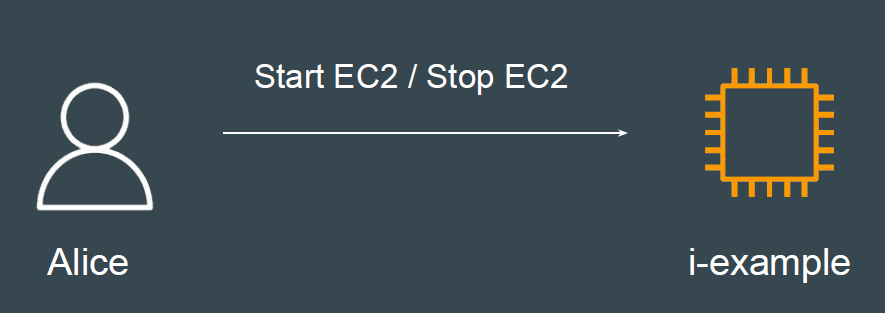

# Requirement of IAM Policy - StartStopEC2

## Understanding the Use-Case

Alice IAM user wants permission to be able to start and stop an EC2 instance
with the instance id if i-example

## Steps to Achieve

1. Create a EC2 instance for testing.

2. Create IAM user for Alice.

3. Create base policy that allows Start and Stop EC2 instance for EC2 created
in Step 1.

4. Ensure that base policy also works with Start/Stop actions performed
through AWS Console.
