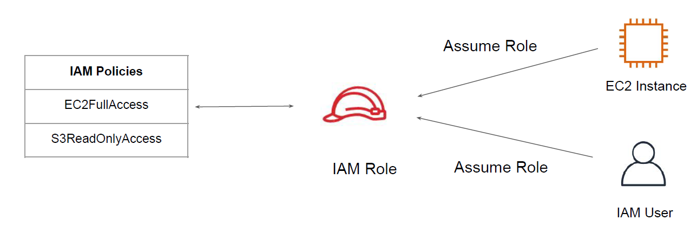
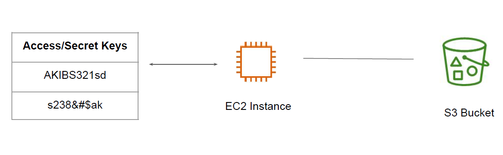
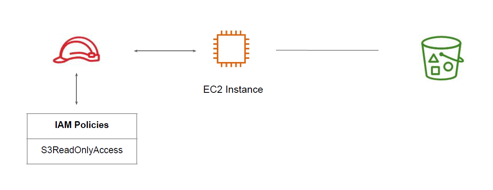

# IAM Roles

Access Management

## Overview of IAM Role

IAM Role is an entity that contains set of policies and any resource assuming that role will
be able to have permissions mentioned in the role.

## Sample Use-Case- No No Scenario

EC2 Instance wants to get data from an S3 bucket.

## Example - Best Practice

It is recommended to always make use of IAM Role instead of hard coding the AWS Access
Keys within EC2 instance / software code.

