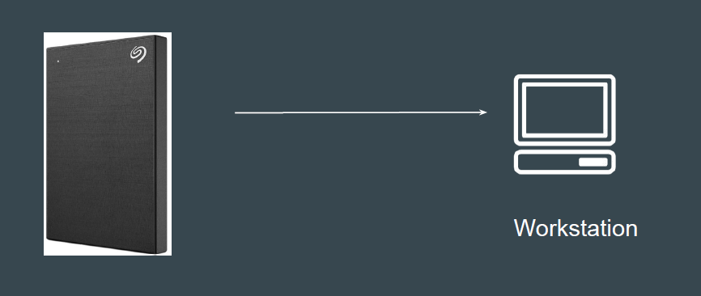
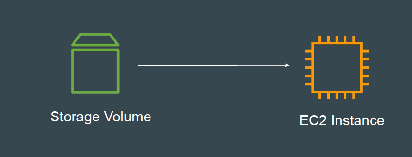
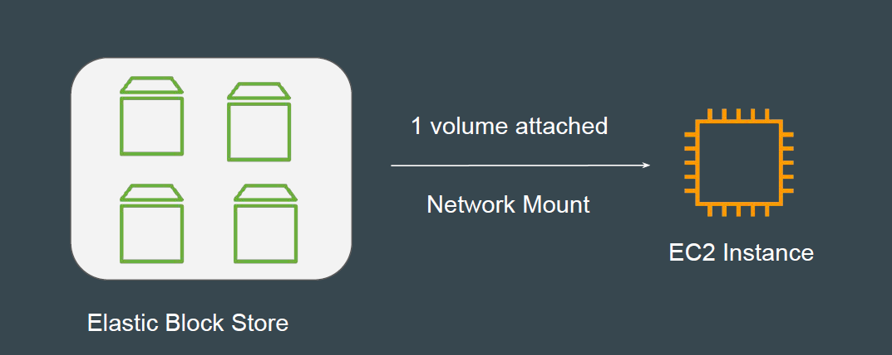
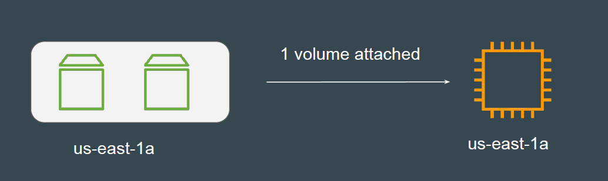
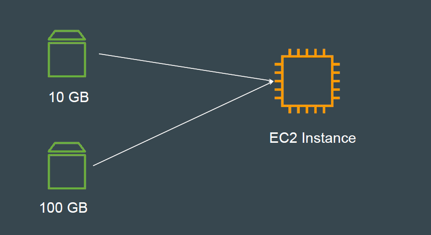

# Elastic Block Store (EBS)

## Simple Use-Case: External Hard Disk

External Hard Disk can be attached to the Workstation and detached whenever
required (portable)
Depending on the use-case, you can buy external storage of different
configuration based on size, performance and others.

## Understanding the Basics

Elastic Block Store (Amazon EBS) is a scalable, high-performance block-storage
service designed for Amazon EC2.
These volumes can be attached and detached from EC2 instance.

## EBS is Network Storage

EBS volumes are attached to EC2 instance through Network.
There can be latency that might be involved.

## Availability Zone Specific

You create an EBS volume in a specific Availability Zone, and then attach it to an
instance in that same Availability Zone.
Cross Availability Zone based attachment is not supported.

## EC2 and EBS Attachment

One EC2 instance can be attached with multiple set of EBS volumes of different
sizes.

