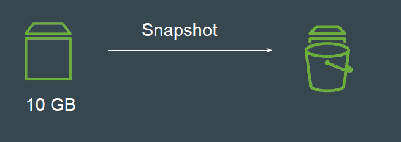
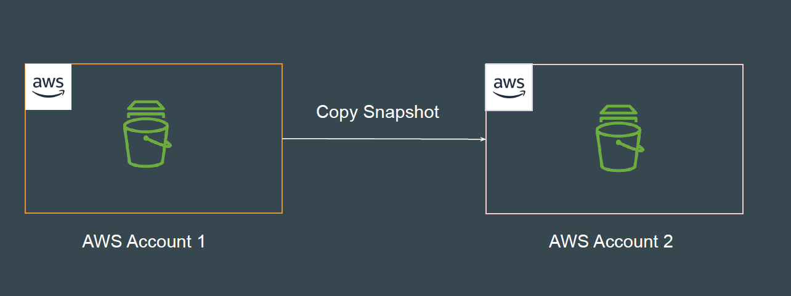
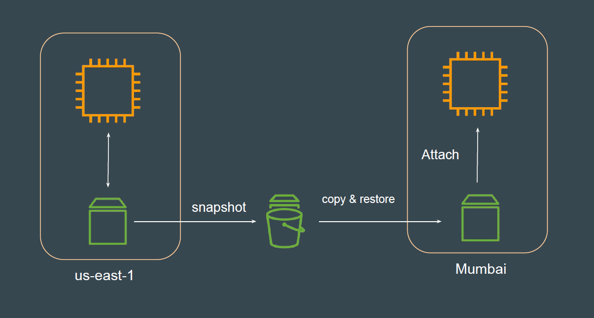

# EBS Snapshots

## Understanding the Basics

You can back up the data on your Amazon EBS volumes to Amazon S3 by
taking point-in-time snapshots.
You can create a new volume from the snapshot.

## Copying Snapshots

Snapshots can be copied across Availability Zone, Regions and AWS Accounts.

## Use-Case: Migrating Data Across Region

