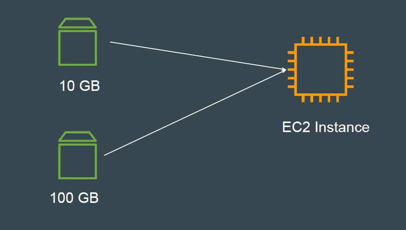
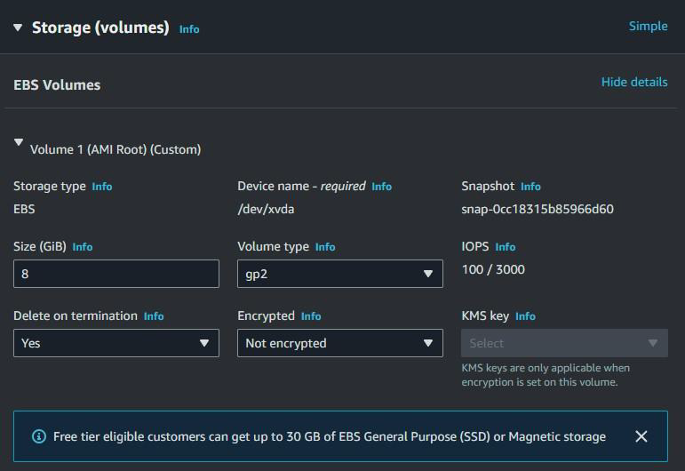

# Delete on Termination Attribute

## Revising the Basics

Since EBS and EC2 are separate set of entities, they can live independently of
each other.

## Basics of Deletion Attribute

When an instance terminates, the value of the DeleteOnTermination attribute
for each attached EBS volume determines whether to preserve or delete the
volume.

