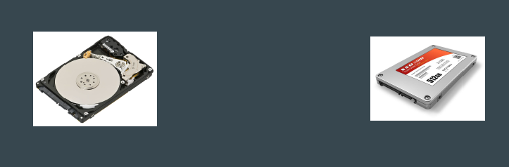
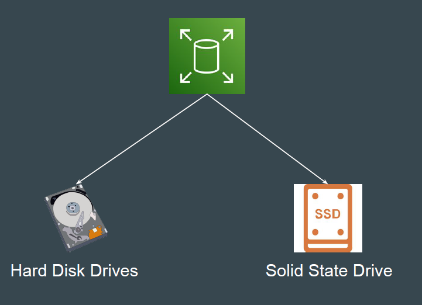
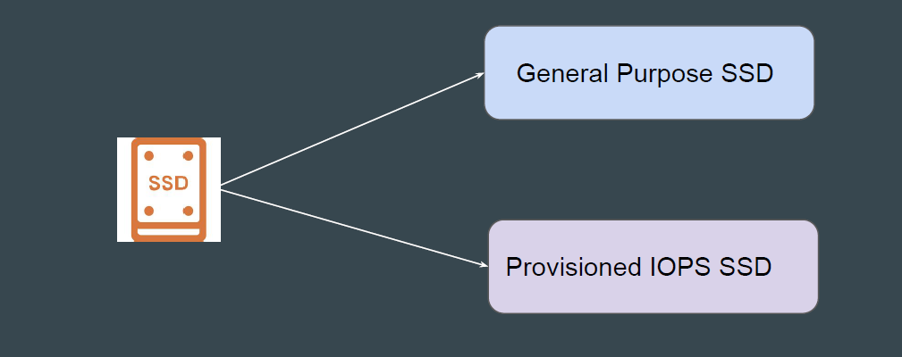
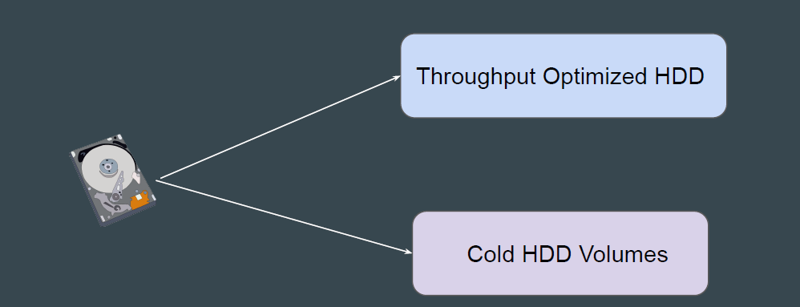
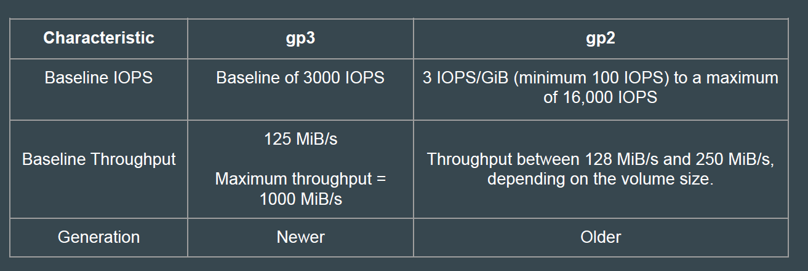
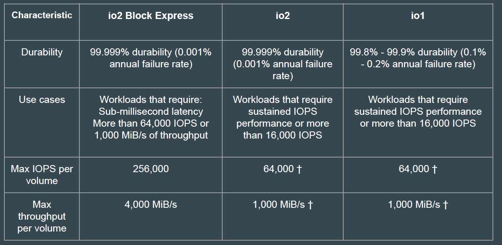
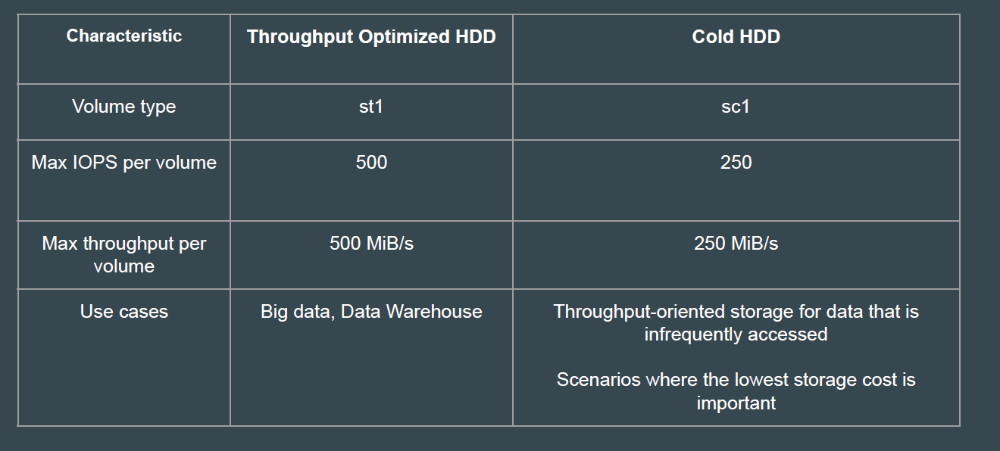

# EBS Volume Types

## Performance Metrics in Storage Device

Storage Device is a piece of equipment on which information can be stored
Common disk performance metrics are :

- Input / Output operations per second ( IOPS )
- Throughput ( MB/s or MiB/s )

## Basic Metrics Information

IOPS is a count of the read/write operations per second
Throughput is the actual measurement of read/write bits per second that are
transferred over a network

## EBS Volume Types

EBS provides different volume types which differs in performance and price.

## Solid State Drives (SSD)

Optimized for transactional workloads involving frequent read/write operations
with small I/O size, where the dominant performance attribute is IOPS.
SSD-backed volume types include:

## Hard Disk Drives (HDD)

Optimized for large streaming workloads where the dominant performance
attribute is throughput.
HDD-backed volume types include:

### Previous Generation

Hard disk drives that you can use for workloads with small datasets where data
is accessed infrequently and performance is not of primary importance.

## General Purpose SSD

gp3 offers SSD-performance at a 20% lower cost per GB than gp2 volumes.

## Provisioned IOPS

Highest performance SSD volume designed for mission critical application workloads.

## Hard Disk Drives

Sample Question
Medium Corp is an E-Commerce organization and you have been assigned
responsibility related to performance optimization of servers. They have a
critical database server which receives lot of connections and they tried
increasing RAM and CPU but still it is slow. What type of EBS volume type will
you suggest ?

- General Purpose SSD
- Throughput Optimized
- Provisioned IOPS
- Cold HDD
