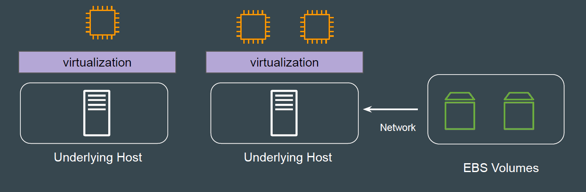
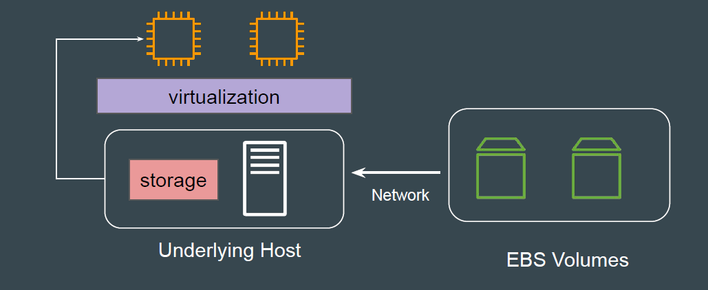
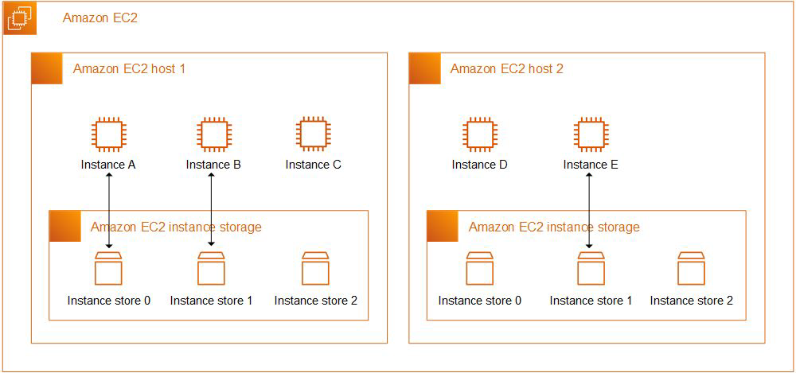
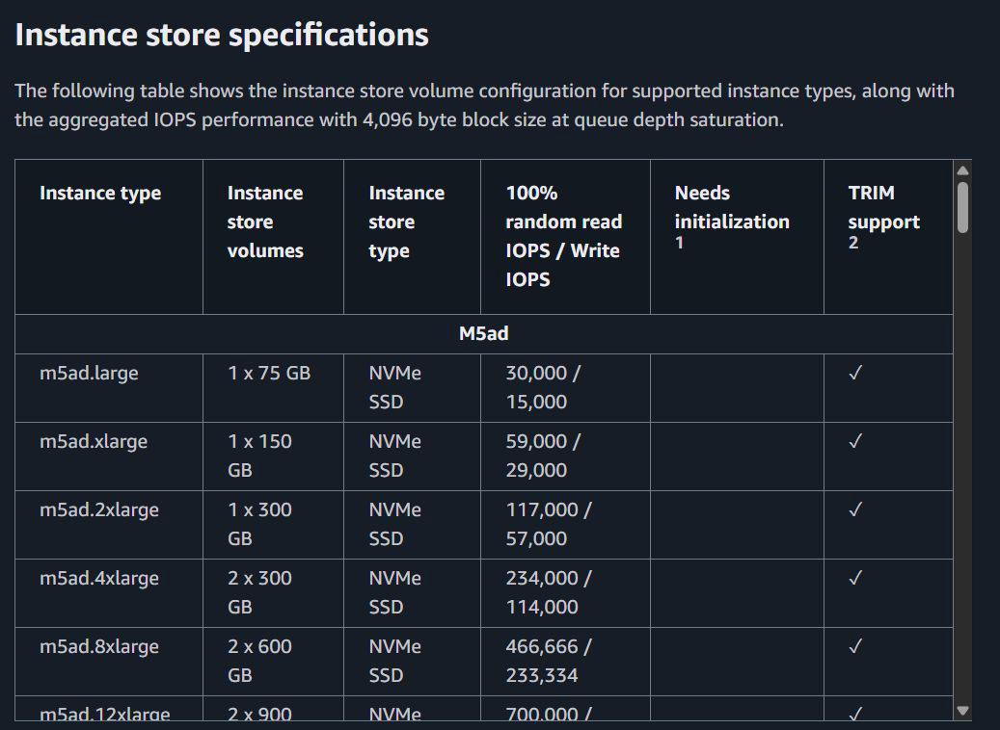

# Instance Store Volumes

## Revising EBS Architecture

EBS volumes are network-attached storage for EC2 instances.
If an EC2 instance is stopped and restarted, it may run on a different physical
host, but the EBS data stays intact because it is stored separately from the
instance.

## Instance Store Volumes

An instance store provides temporary block-level storage for your EC2
instance.
This storage is provided by disks that are physically attached to the host.

## Reference Architecture - Instance Store Volumes

## Advantages of Instance Store Volumes

| Advantages            | Description |
|----------------------|------------|
| High Performance     | Low latency and high IOPS because storage is physically attached to the host.    Ideal for workloads needing ultra-fast temporary storage |
| No Additional Cost   | Included in the instance price for supported instance types.   No extra charges like those for EBS volumes. |

## Disadvantages of Instance Store Volumes

If you use instance store, be sure to backup your data to central storage such as S3.

| Disadvantages              | Description |
|---------------------------|------------|
| No Data Persistence       | Data is lost if the instance is stopped, terminated, or fails.    You cannot rely on instance store for storing important or long-term data. |
| Limited Availability      | Not all instance types support instance store volumes. |
| No Resizing or Migration  | Cannot resize instance store volumes or move them to another instance. |

## Data Persistence Table

| User-initiated instance lifecycle events | What happens to your data? |
|------------------------------------------|----------------------------|
| The instance is rebooted                 | The data persists          |
| The instance is stopped                  | The data does not persist  |
| The instance is terminated               | The data does not persist  |
| The instance type is changed             | The data does not persist  |

## Additional Points to Note

The number, size, and type of instance store volumes are determined by the
instance type.
Not every instance type provides instance store volumes.

