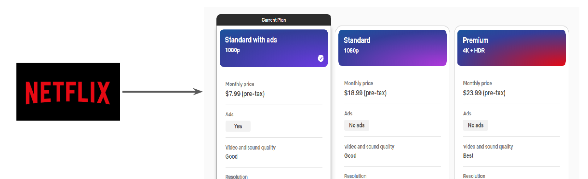

# S3 Storage Classes

"Cloud Storage is Saviour"

Use-Case - Netflix

Netflix offers various different subscription plans for various category of requirements.
Main Aim: Watch the Entertainment Content

## Initial Challenge - S3

AWS has millions of active customers.
Each customer might have different requirements for data storage.
Main Aim: Store Data.

## S3 Storage Classes

knowledge portal
Amazon S3 offers a range of storage classes designed for different use cases.

| Storage Classes                 | Description |
|--------------------------------|------------|
| S3 Standard                    | Offers high durability, availability, and performance object storage for frequently accessed data |
| S3 Standard-Infrequent Access  | For data that is accessed less frequently, but requires rapid access when needed. |
| Amazon S3 Glacier              | Low-cost storage class for data archiving |

## AWS S3 Standard

S3 Standard offers high durability, availability, and performance object storage for frequently
accessed data.
Designed for durability of 99.999999999% of objects ( eleven nines )
Example :-
If we have 10,000 files stored in S3 ( 11 nines durability ) then you can expect to lose one file
every ten million years.

## AWS S3 Standard IA -US East region

S3 Standard-IA is for data that is accessed less frequently, but requires rapid access when
needed.
Comparing storage cost of 1TB data stored in S3 based on accessibility patterns.

| Criteria                              | Amazon S3 | Amazon S3 IA |
|--------------------------------------|-----------|--------------|
| Storage of 1TB Data                  | $23.55    | $23.04     |
| 50% storage accessed in last 30 days | -         | $17.80     |
| 0% storage accessed in last 30 days  | -         | $12.80       |

## Amazon S3 Glacier (Instant retrieval) - US East region

Glacier is meant to be for archiving and for storing long-term backups.
Ideally meant for data that needs to be archived for years without much requirement of access.

| Criteria             | Amazon S3 | Glacier |
|----------------------|-----------|---------|
| Storage of 1TB Data | $23.55   | $4.10   |

## Multiple S3 Storage Classes

 Perfomance accrso the S3 Storage Classes

| Criteria                          | S3 Standard | S3 Intelligent-Tiering | S3 Standard-IA | S3 One Zone-IA | S3 Glacier | S3 Glacier Deep Archive |
|----------------------------------|-------------|------------------------|----------------|----------------|------------|--------------------------|
| Designed for durability          | 99.999999999% (11 9's) | 99.999999999% (11 9's) | 99.999999999% (11 9's) | 99.999999999% (11 9's) | 99.999999999% (11 9's) | 99.999999999% (11 9's) |
| Designed for availability        | 99.99%      | 99.9%                  | 99.9%          | 99.5%          | 99.99%     | 99.99%                  |
| Availability SLA                 | 99.9%       | 99%                    | 99%            | 99%            | 99.9%      | 99.9%                   |
| Availability Zones               | ≥3          | ≥3                     | ≥3             | 1              | ≥3         | ≥3                      |
| Minimum capacity charge per object | N/A        | N/A                    | 128KB          | 128KB          | 40KB       | 40KB                    |
| Minimum storage duration charge  | N/A         | 30 days                | 30 days        | 30 days        | 90 days    | 180 days                |

## Durability vs Availability

- Durability is percent ( % ) over one year period of time that the file which is stored in S3
will not be lost.
- Availability is percent (%) over one year period of time that the file stored in S3 will
not be available.
Example :-
For Servers, Availability is one of the key metric and any minute of downtime is a loss.
However what happens if component of server itself fails and server goes down ?
