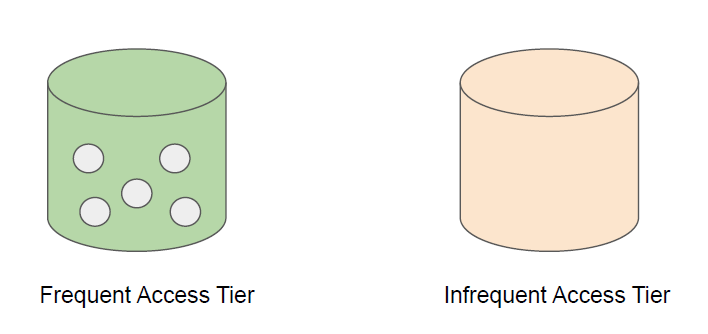
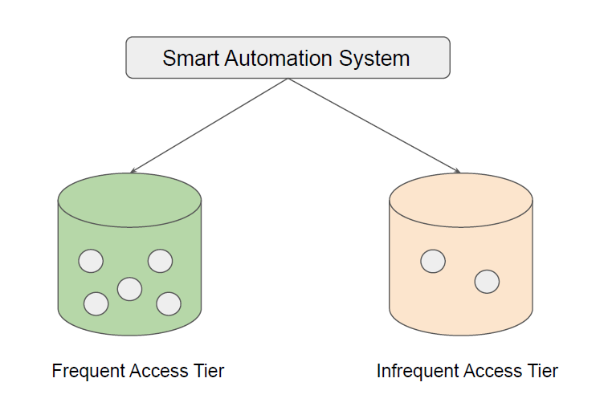

# S3 Intelligent-Tiering

"Smart Automated System"

## Overview of S3 Intelligent Tiering

The S3 Intelligent Tiering is primarily designed to optimize cost by automatically moving
data to most cost-effective tier.
● 1TB of data stored in Standard S3 = $23.44
● 1TB of data stored in Standard IA = $12.80
Organization stores terabytes of data in S3.
It will be great if a solution automatically moves infrequent data to Standard IA.

## Overview of S3 Intelligent Tiering

The S3 Intelligent Tiering works by storing data in one of the two access tiers:

- Frequent Access Tier (Costly)
- Infrequent Access Tier (Much cheaper)

## Overview of S3 Intelligent Tiering

## Revising S3 Intelligent Tiering

Amazon S3 monitors access patterns of the objects in S3 Intelligent-Tiering, and moves the
ones that have not been accessed for 30 consecutive days to the infrequent access tier.
If an object in the infrequent access tier is accessed, it is automatically moved back to the
frequent access tier.
A monthly monitoring and automation fee is charged at a per object level.
