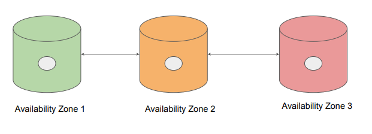
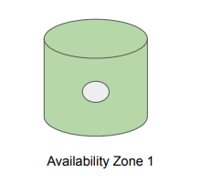

# S3 Storage Class - One Zone IA

"Back again"

## Understanding the Basics

Storage classes like Standard S3, Standard IA stores the data in minimum 3 availability zones.
Due to this, the overall cost per of storage is increased with such architecture.

## Overview of One Zone IA

S3 One Zone-IA stores data in a single AZ and costs 20% less than S3 Standard-IA.
It’s a good choice for storing secondary backup copies of on-premises data or easily recreatable
data.
Data will be lost in-case of availability zone destruction.

## Pricing Comparison

Overview of Pricing comparison between storage classes:

- 1TB of data stored in Standard S3 = $23.55
- 1TB of data stored in Standard IA = $12.80
- 1TB of data stored in One Zone IA = $10.24
