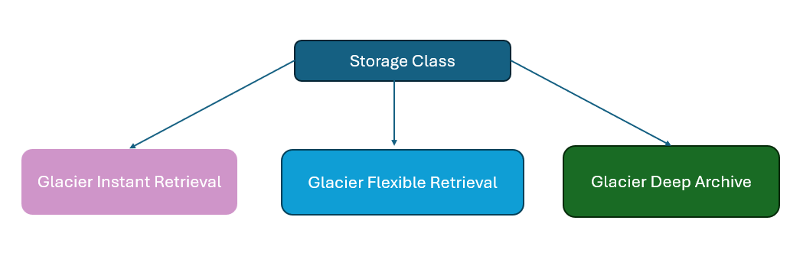

# S3 Storage Class - Glacier

## Overview of Glacier

Amazon S3 Glacier is a low-cost, cloud-archive storage service that provides secure and durable
storage for data archiving and online backup

## Pricing Comparison

| Storage Class & Data Storage            | Pricing |
|----------------------------------------|---------|
| 1 TB Data stored in S3 Standard        | $23.55  |
| 1 TB Data stored in One Zone IA        | $12.80  |
| 1 TB Data stored in Glacier (Flexisble/Instant)  | $4.10   |
| 1 TB Data stored in Glacier Archive    | $1.03 |

## Glacier vs Glacier Deep Archive

To keep costs low, Amazon S3 Glacier provides three options for access to archives, from a few
minutes to several hours.
Glacier Deep Archive provides two access options, which range from 9 to 48 hours

| S3 Glacier storage class        | Minimum storage duration | Recommended access frequency | Average retrieval times   | Archival? |
|--------------------------------|--------------------------|------------------------------|---------------------------|-----------|
| S3 Glacier Instant Retrieval   | 90 days                  | Quarterly                    | Milliseconds              | No        |
| S3 Glacier Flexible Retrieval  | 90 days                  | Semi-annually                | Minutes to 12 hours       | Yes       |
| S3 Glacier Deep Archive        | 180 days                 | Annually                     | 9 to 48 hours             | Yes       |
