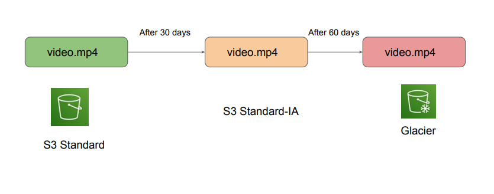

# S3 Lifecycle Policies

## Overview of Lifecycle Policies

Organizations tends to keep terabytes of data in S3. For such cases, cost becomes a primary
factor.
Storing the data directly into the AWS S3 Standard is not the best approach. Depending on the
access patterns, criticality of the data, data should be transitioned to appropriate storage class.

- We can store 1 months of logs in Amazon S3 Standard.
- Move the logs older than 1 month to S3 Standard-IA
- Move the logs older than 6 months to Glacier

