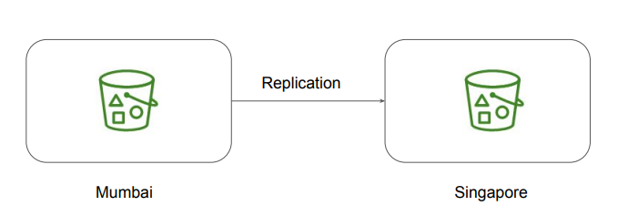

# S3 - Cross Region Replication

Understanding the Use-Case
Many compliance has a requirement that the data must be replicated across greater
distances.
Cross-Region Replication allows data from S3 buckets to be replicated across regions.

Important Pointers
Both source and destination buckets must have versioning enabled.
