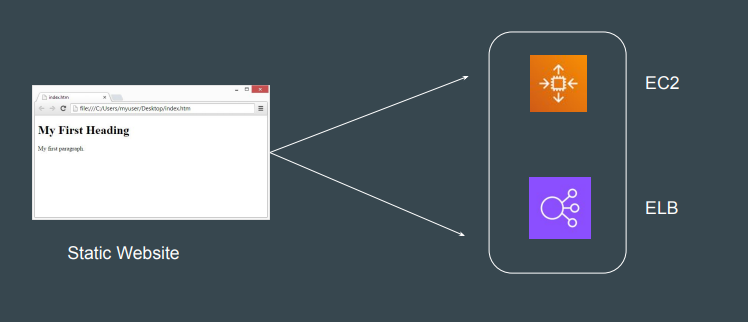
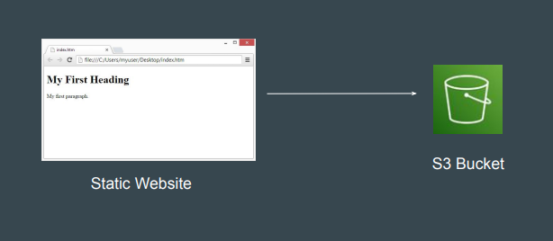
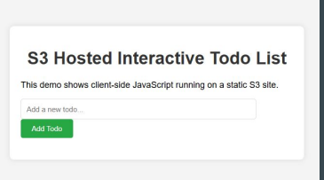
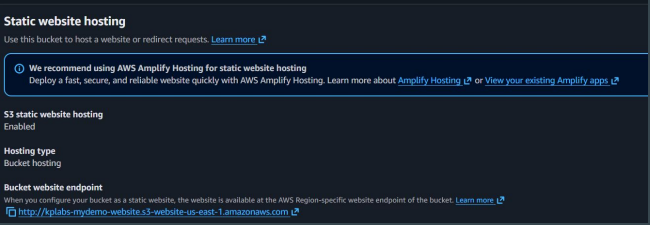

# Static Website Hosting in S3

## Understanding the Challenge

If you want to host a basic static website, you need to create and manage the
entire server related infrastructure on a cloud provider.

## Static Website Hosting in S3

With Amazon S3, you can host static websites directly.

## Points to Note

1. On a static website, individual web pages include static content. They
might also contain client-side scripts (JavaScript).
2. Dynamic website relies on server-side processing, including server-side
scripts such as PHP, JSP, or ASP.NET.

For S3 static hosting to work, the bucket must be publicly accessible, and
you need to enable the "Static website hosting" feature in the bucket
properties.

