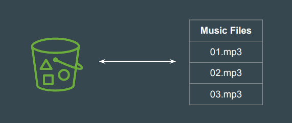
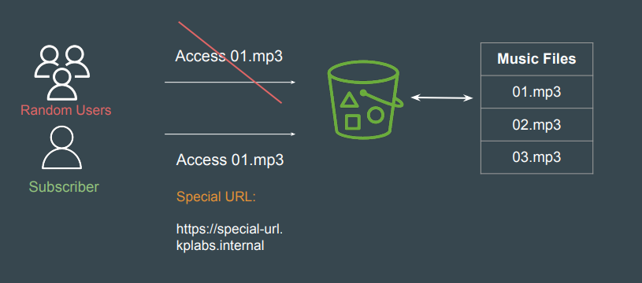

# S3 - Presigned URLs

## Understanding a Use-Case

A music company stores all its MP3 files in an Amazon S3 bucket.
They want to allow customers to download specific music files only after
purchase via their website.

## Setting the Base

By default, all Amazon S3 objects are private, only the object owner has
permission to access them.
However, the object owner may share objects with others by creating a
presigned URL.

## Introducing Presigned URLs

A Presigned is a special link that provides time-limited permission to download
objects.

