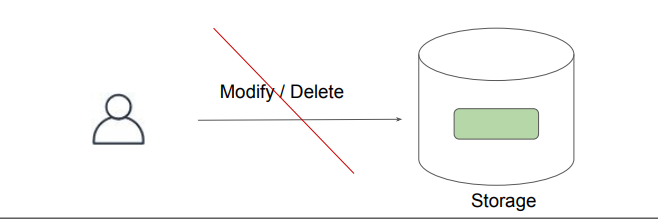
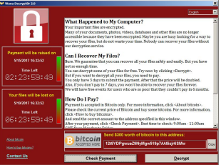
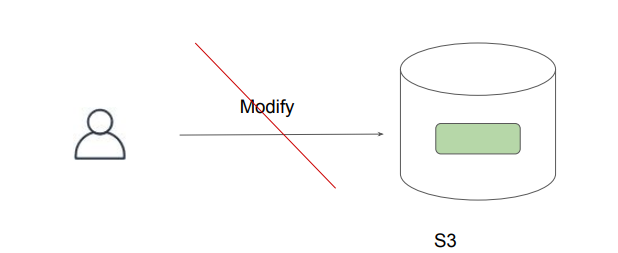

# S3 Object Lock

"Mastering S3"

## Overview of WORM

Write once read many (WORM) describes a data storage device in which information, once
written, cannot be modified.
This write protection affords the assurance that the data cannot be tampered with once it is
written to the device.

## Use-Case - Ransomware

Ransomware also blackmail trojans , blackmail software are malicious programs with the
help of which an intruder can prevent the computer owner from accessing data, its use or the
entire computer system.
Private data on the foreign computer is encrypted or access to it is prevented in order to
demand a ransom for decryption or release.

## S3 Object Lock

With S3 Object Lock, you can store objects using a write-once-read-many (WORM) model.
You can use it to prevent an object from being deleted or overwritten for a fixed amount of
time or indefinitely.

## Retention Modes

| Retention Mode     | Description |
|--------------------|-------------|
| **Governance Mode** | When deployed in Governance Mode, AWS accounts with specific IAM permissions can remove object locks from objects. |
| **Compliance Mode** | In Compliance Mode, the protection cannot be removed by any user, including the root account. |
