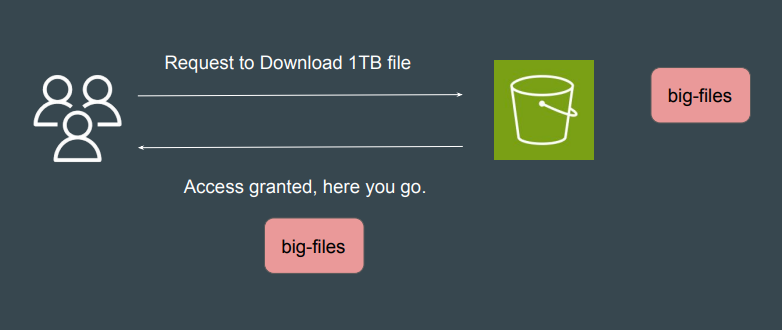
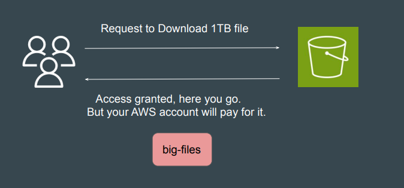

# S3 - Requester Pays

## Understanding the Challenge

In general, bucket owners pay for all Amazon S3 storage and data transfer costs
that are associated with their bucket.

## Overview of Requester Pays

With Requester Pays buckets, the requester instead of the bucket owner pays
the cost of the request and the data download from the bucket.

Points to Note

1. The bucket owner always pays the cost of storing data.
2. If you enable Requester Pays on a general purpose bucket, anonymous
access to that bucket is not allowed.
3. After you configure a bucket to be a Requester Pays bucket, requesters
must show they understand that they will be charged for the request and
for the data download.
4. To show they accept the charges, requesters must either include
x-amz-request-payer as a header in their API request, or add the
RequestPayer parameter in their REST request. For CLI requests,
requesters can use the --request-payer parameter.
