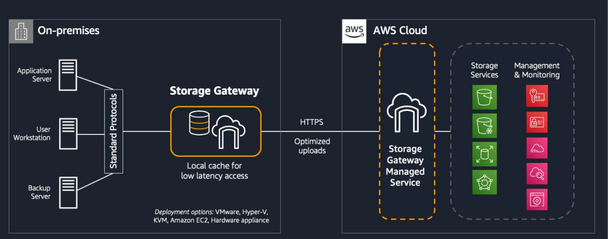
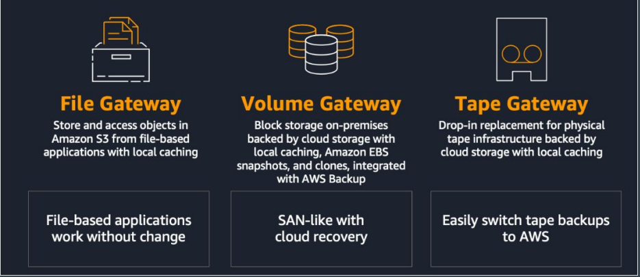
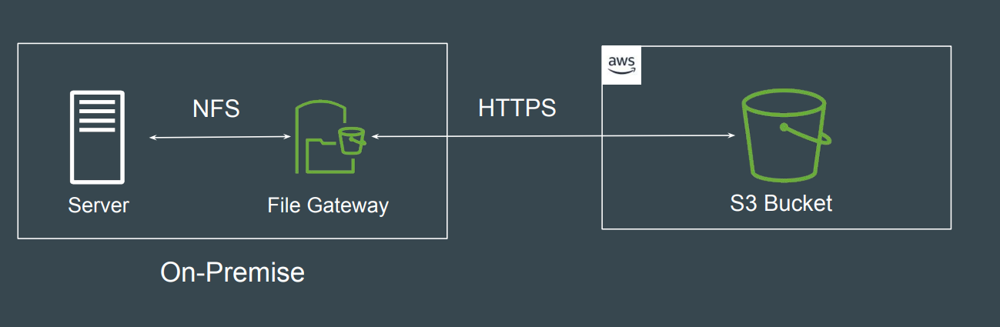
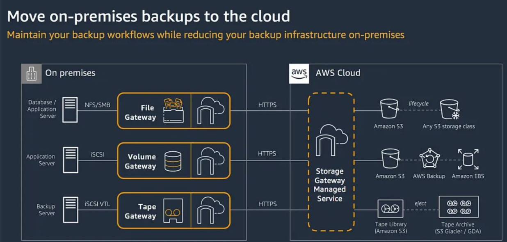
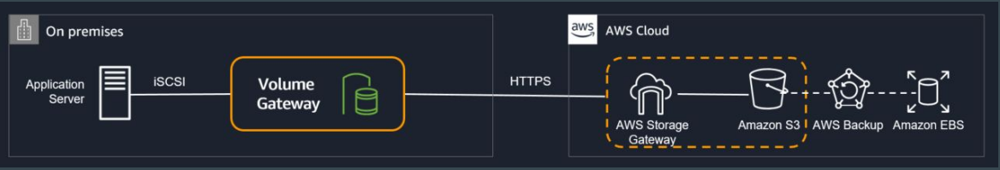
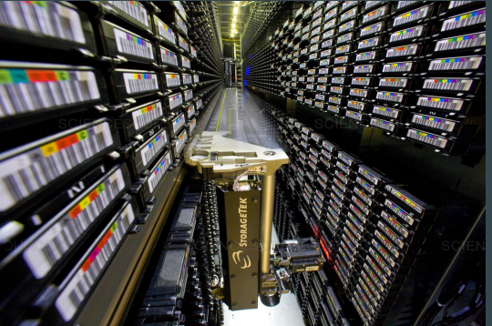
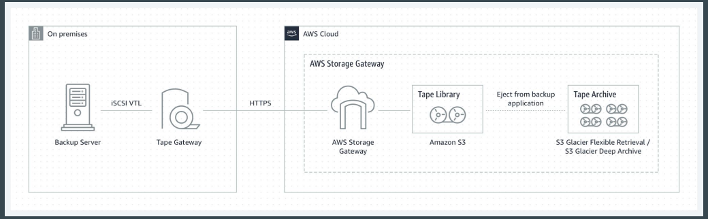

# Storage Gateway

## Setting the Base

Storage Gateway enables on-premises applications to use cloud storage by
providing low-latency data access over standard storage protocols.

## Types of Gateway

AWS provides three different types of gateways.

## S3 File Gateway

Amazon S3 File Gateway enables file system mount on Amazon S3, allowing
access to data directly in S3 using NFS or SMB protocols

## Volume Gateway

Volume Gateway presents cloud-backed iSCSI block storage volumes to your
on-premises applications.
Volume Gateway stores and manages on-premises data in Amazon S3 on your
behalf

## Tape Based Storage

Tape storage is a method of storing digital data on magnetic tape.
While it may sound old-fashioned compared to modern SSDs and hard drives,
tape storage is still widely used, especially in enterprise and archival contexts
and benefits from cheaper storage cost

## Tape Gateway

You can use Tape Gateway to replace physical tapes with virtual tapes in AWS.
Tape Gateway acts as a drop-in replacement for tape libraries, tape media, and
archiving services, without requiring changes to existing software or archiving
workflows. Most used for enterprise backup purposes.

