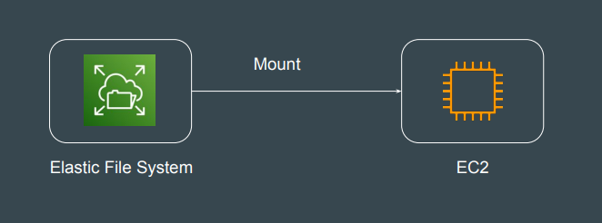
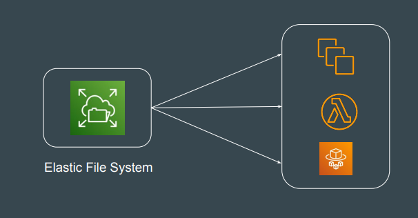
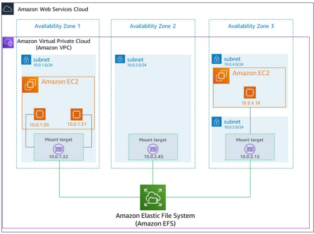

# Elastic File System (EFS)

## Introduction to EFS

The Elastic File System (EFS) is a scalable, fully-managed file storage service
provided by AWS
Amazon EFS file systems can automatically scale from gigabytes to petabytes of
data without needing to provision storage.

## Attachment to Multiple Targets

Multiple compute services, such as EC2, ECS, and Lambda, can simultaneously
access an EFS file system as a shared data source.

## EFS Architecture

A mount target in Amazon EFS is a network endpoint in your VPC that enables
EC2 instances or other resources within that VPC to connect to your EFS file
system using the NFS protocol.

## Price Consideration

Amazon EFS is expensive when compared to other storage options like EBS, S3.

| Consideration(us-east1)       | Pricing |
|----------------------|---------|
| 1 TB EFS - (no R/W)             | $307.20   |
| 1 TB EBS Storage     | $102.40    |
| 1 TB of standard S3 Storage   | $24.27    |

## Points to Note

1- If performance is your concern, prefer EBS over EFS.

2- EFS can even be accessed from on-premise datacenter using an AWS Direct
Connect or AWS VPN connection.

3- With Amazon EFS, you pay only for what you use per month.
