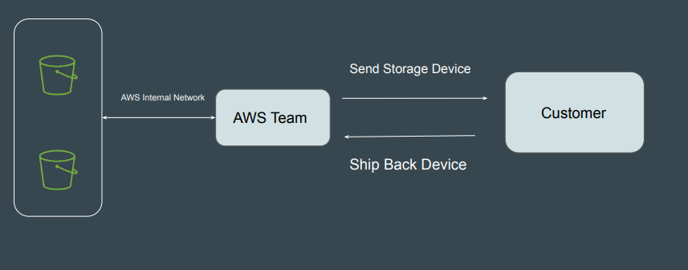
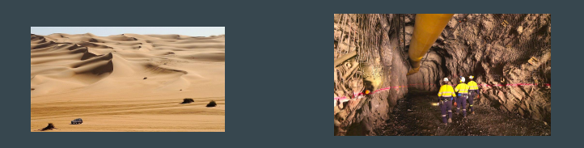
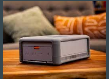
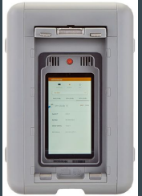
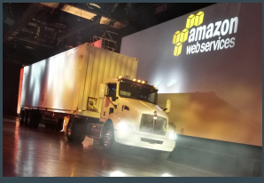
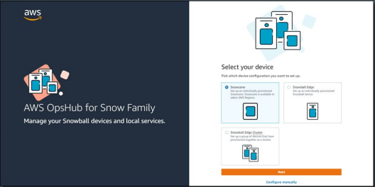

# AWS Snowball Family

## Understanding with Use-Case

Organization A has hosted all of it’s storage infrastructure in data-center.
Total Storage: 500 TB.
They have now decided to use S3 due to the benefits that it provides.

| Bandwidth | Transfer Time |
|----------|---------------|
| 100 Mbps | 510 days |
| 500 Mbps | 101 days |
| 1 Gbps   | 50 days |

## AWS Snowball Family

Allows customers to Accelerate moving offline data or remote storage to the
cloud

## Edge Computing Functionality

These devices can also come with edge computing capabilities.
This means, you can run your applications in EC2 instances in the devices so
that you can work in edge environments with limited connectivity.
Process data locally (Image/ Video Processing, Machine Learning etc)

## Snowcone

AWS Snowcone is a small, rugged, and secure device offering edge computing,
data storage, and data transfer on-the-go, in severe environment with little or no
connectivity.

- Can carry in backpack, drones and others.

- 8 TB of usable storage

## Snowball Edge

AWS Snowball Edge is a type of Snowball device with on-board storage and
compute power for select AWS capabilities
Available in Multiple Storage Capacity like 100 TB, 40 TB and others.

| Device | Description |
|-------|-------------|
| Snowball Edge Storage Optimized (for data transfer) | This option has a 100 TB (80 TB usable) storage capacity. |
| Snowball Edge Storage Optimized (with EC2 compute functionality) | This option has up to 80 TB of usable storage space, 24 vCPUs, and 80 GB of memory for compute functionality. |
| Snowball Edge Compute Optimized | Most compute functionality, with 104 vCPUs, 416 GB of memory, and 28 TB of dedicated NVMe SSD for compute instances. |
| Snowball Edge Compute Optimized with GPU | Identical to the Compute Optimized option, except for an installed GPU. |

## AWS Snowmobile

AWS Snowmobile moves extremely large amounts of data to AWS.
Transfer up to 100 PB per Snowmobile, a 45-foot-long ruggedized shipping
container pulled by a semi-trailer truck.

## AWS OpsHub

AWS OpsHub is a graphical user interface you can use to manage your AWS
Snowball devices.

