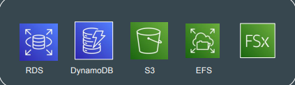
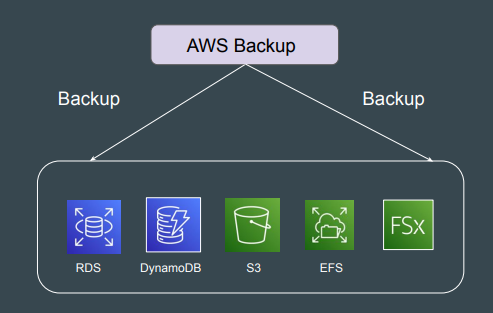

# AWS Backup

## Understanding with Use-Case

AWS has lots of services where data can be stored.
For production environment, data backup is one of the critical task.
Taking backup at individual service level can take lot of time and require
customization.

## Introducing AWS Backup

AWS Backup is a fully-managed service that allows customers to configure
backup policies in one central place.

## Benefits of using AWS Backup

- Easily create backup rules for daily, monthly backups.
- Backup Process is automated at a scheduled time.
- Supports Cross-Region, Cross-Account Backups.
- AWS Backup can back up on-premises Storage Gateway volumes and
VMware virtual machines
- Supports Retention Period that tells how long to store backup.
