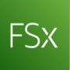

# Amazon Fsx

# Basics of Filesystems

There are multiple popular set of file systems / storage platforms available in the
industry that are used extensively based on specific use-cases

| File Systems | Description |
|-------------|-------------|
| Lustre | Parallel distributed file system, generally used for large-scale cluster computing (HPC) |
| Open ZFS | Encompasses the functionality of traditional file systems and logical volume manager.  **Benefits:** protection against data corruption, efficient data compression, etc. |

## Understanding the Challenges

Many organizations have use-case to leverage the rich feature sets and fast
performance of widely-used open source and commercially-licensed file
systems.
This would lead to lot of time-consuming administrative tasks like hardware
provisioning, software configuration, patching, and backups

## Introduction to FSx

Amazon FSx makes it easy and cost effective to launch and run popular file
systems.
It provides cost-efficient capacity and high levels of reliability, and integrates with
other AWS services so that you can manage and use the file systems in
cloud-native ways.

| Benefits | Description |
|---------|-------------|
| Simple and fully managed | In minutes and with a few clicks, you can launch a fully managed file system.  No need to worry about configuring, patching, backups, etc. |
| Secure and compliant | Amazon FSx automatically encrypts your data at rest and in transit.  Complies with PCI-DSS, ISO, SOC certifications. |
| Integration with AWS services | Integrate with AWS services, including Amazon S3, AWS KMS, Amazon SageMaker, Amazon WorkSpaces, AWS ParallelCluster. |
``

## Amazon FSx for Lustre

Provides cost-effective, high-performance, scalable file storage for compute
workloads such as machine learning, high performance computing (HPC), video
processing, and financial modeling.
Integrates seamlessly with Amazon S3, SageMaker, EKS etc

## Amazon FSx for Windows File Server

Provides simple, fully managed, highly reliable file storage that’s accessible over
the industry-standard Server Message Block (SMB) protocol.
Built on Windows Server, providing full SMB support and a wide range of
administrative features like user quotas, data deduplication, and end-user file
restore. Accessible from Windows, Linux, and macOS.
Integrates with Microsoft Active Directory (AD) to support Windows-based
environments and enterpris

## FSx for OpenZFS

Provides simple, cost-effective, high-performance file storage built on the
OpenZFS file system accessible over the industry-standard NFS protocol.
Provides powerful OpenZFS data management capabilities including
Z-Standard/LZ4 compression, instant point-in-time snapshots, and data cloning,
thin provisioning, and user/group quotas.

## Amazon FSx for NetApp ONTAP

Provides feature-rich, high-performance, and highly-reliable storage built on
NetApp’s popular ONTAP file system and fully managed by AWS.
Accessible via industry-standard NFS, SMB, and iSCSI protocols.
Integrates with Microsoft Active Directory (AD) to support Windows-based
environments and enterprises.
