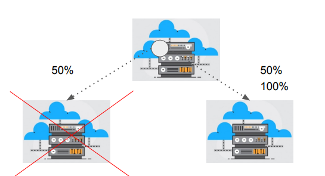

# High Availability

"Multiple is better "

## Everything fails, all the time

## What is High Availability ?

- High Availability is a characteristic of the system design which makes resource
available even in the case of any component failure in a computer system.

- Availability refers to amount of time that the system is in functioning condition

- General Availability: 100% minus system downtime

| Percent of uptime | Max downtime per year | Equiv downtime per day |
|-------------------|-----------------------|-------------------------|
| 90%               | 36.5 days             | 2.4 hours               |
| 99%               | 3.65 days             | 14 minutes              |
| 99.9%             | 8.76 hours            | 86 seconds              |

## Probability

Events that might disrupt the system’s availability can occur any time, we need to make
sure that application is designed to be highly available.

## Important Points

- Improving availability leads to increase in cost. Thus it’s important to balance between
the cost factor and the availability.

- SLA of your organization matters. 90% SLA means 2.4 hours of downtime every day.

