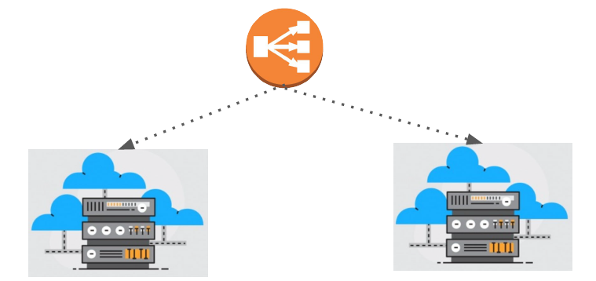
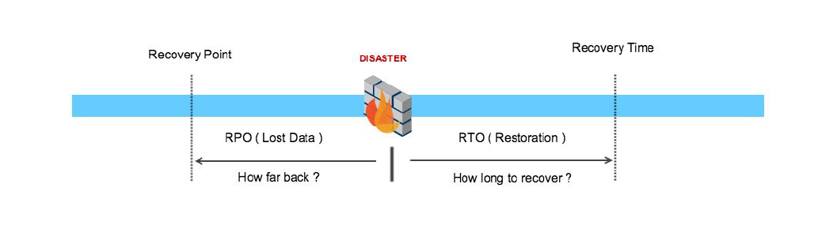

## RTO & RPO

"Health should always be good"

## Everything comes at price

- High Availability Architecture is driven by your requirements.

- An highly available, multi-AZ, fault tolerant infrastructure is certainly possible,
however there is cost associated with it.

## Recovery Time Objective

- Recovery Time Objective (RTO) is the amount of time frame it takes for you to
recover your infrastructure and business operations after disaster has struck.

### Sample Example

- If RTO is 3 hours, then one needs to invest quiet good amount of money to make sure
DR region is always ready in-case main region goes down due to disaster.

## Recovery Point Objective

- Recovery Point Objective (RPO) is concerned with data and maximum tolerance
period to which data can be lost.

- It helps in determining how well we should be designing the infrastructure.

### Sample Example

- If RPO is 5 hours for database, then we should be taking backup of database every five
hours .

## RTO vs RPO

- RTO is more broader scope and covers whole business and systems involved while
RPO is more directly related to interval of backup to take to avoid data loss.

