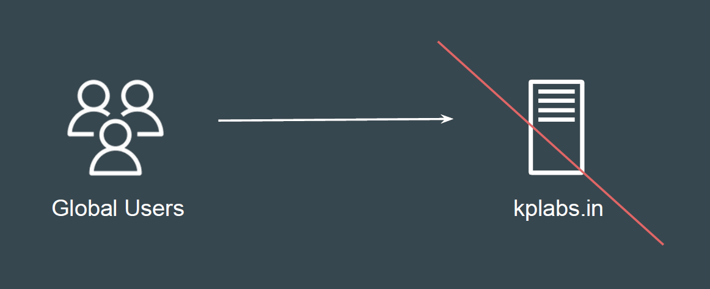
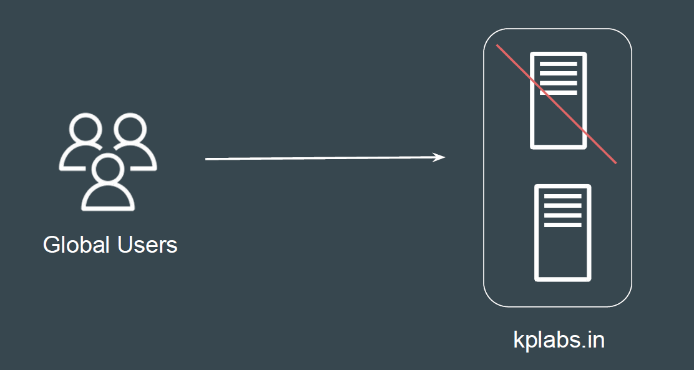
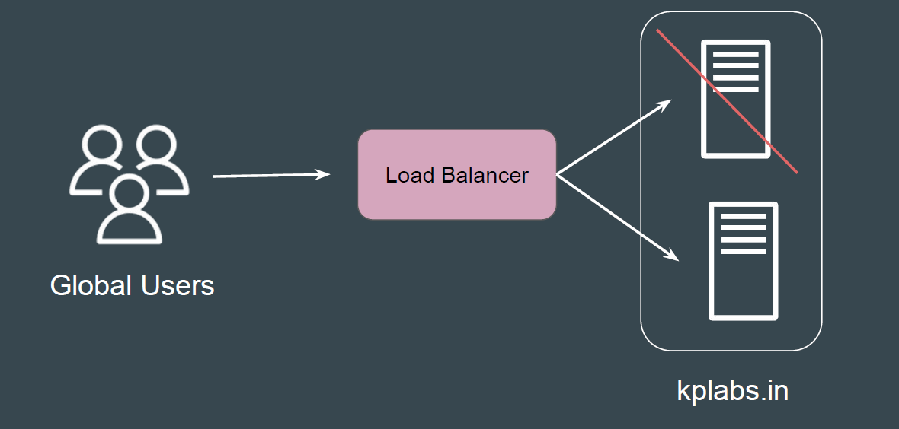
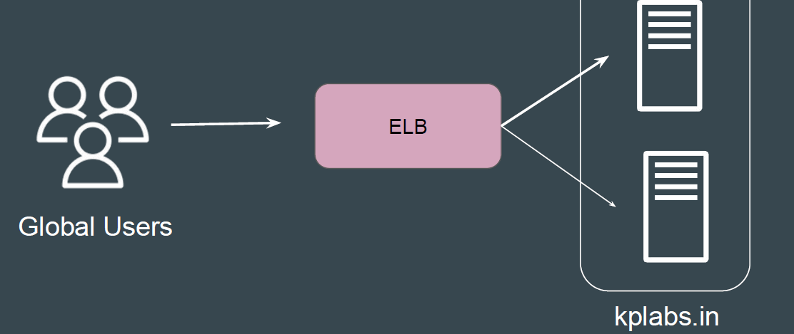

# Elastic Load Balancers

## Understanding the Challenge

A single server creates a single point of failure, risking complete downtime if it
crashes.

## Multiple Server Architecture is Good

Organization uses multiple set of servers to prevent a single point of failure

## Challenge with Multi-Server Architecture

1- Some servers may become overloaded while others are underused,
causing inconsistent performance.

2- Adding or removing servers requires manual reconfiguration and DNS
changes, making scaling cumbersome.

## Importance of Load Balancers

Load balancers distribute incoming traffic evenly across multiple servers,
preventing overload. If one server goes down, the load balancer automatically
redirects users to healthy servers.

## Challenges with Self Managed Load Balancer

If you are self-managing the Load Balancer, you have to take care of all the
aspects related to it.

1. High Availability.

2. Performance

3. Security

What if your load balancer goes down?

## Elastic Load Balancing Service

Elastic Load Balancer allows us to distribute the incoming traffic to multiple
instances, similar to what a traditional load balancer does.
As it’s a managed service, the client does not have to worry about the high
availability-related aspects.

