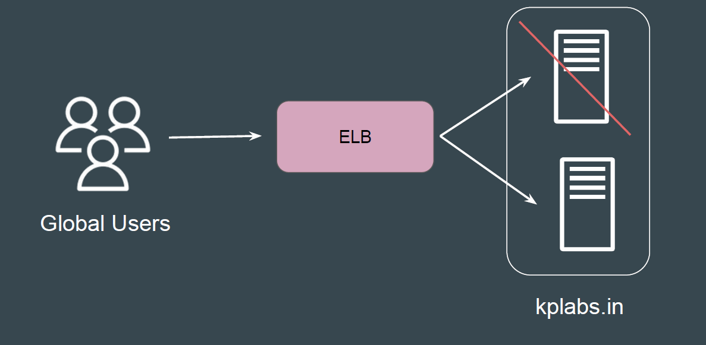

# Classic Load Balancers

## Setting the Base

Classic Load Balancers are the previous generation of load balancers from
Elastic Load Balancing.

## Point to Note

Since these are previous-generation load balancers, various advanced features
are missing. AWS recommends using Application/Network load balancer instead,
based on the requirement.
Example:

1. Does not support native HTTP/2 protocol.

2. IP address as targets are not supported.

3. Path based routing is not supported. (eg: /images should go to server 1 &
/php to server 02)

## usefull documents
<https://aws.amazon.com/elasticloadbalancing>
