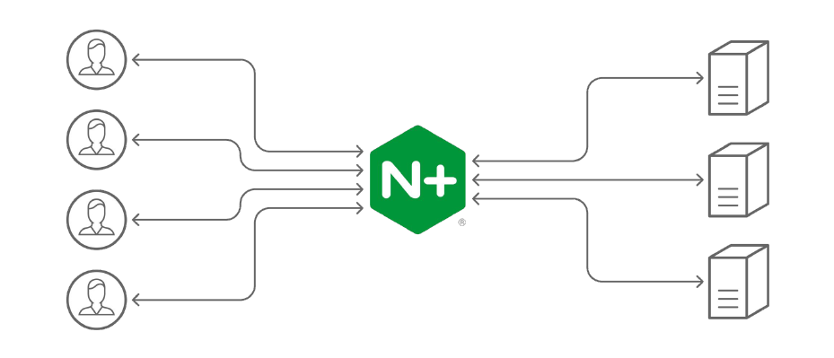
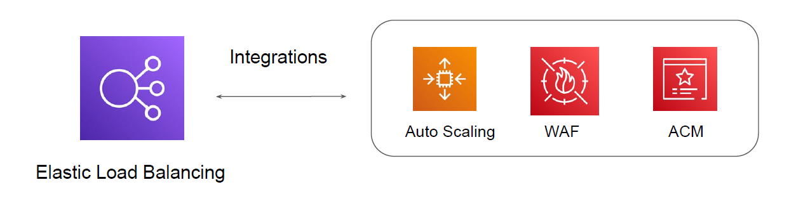
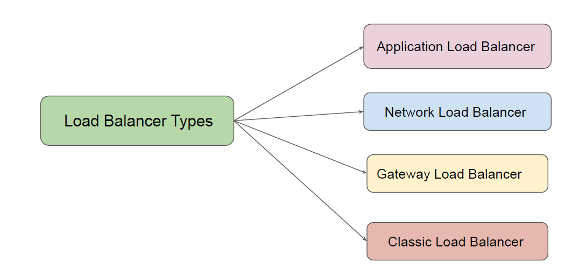

# Load Balancing in AWS

"Let’s Load Balance Traffic in AWS"

Basics of Load Balancing
There are multiple software and hardware based load balancing solutions available.
Some of the popular ones include Nginx, HA Proxy, F5, Riverbed, Traefic ad others.

## Challenges with Maintaining Load Balancing Solution

If you are using a load balancing solution, various responsibilities falls to customer.
Some of these include:

1. High-Availability of Load Balancers.

2. Security.

3. Performance.

## Basics of Elastic Load Balancing Service

AWS offers managed load balancing solutions for wide variety of use-cases.
These solutions are offered under the Elastic Load Balancing feature.
Tight integration with multiple AWS Services.

## Types of Load Balancers

There are 4 primary type of Load Balancer offerings available.

# Summary Slide

| Load Balancer            | Important Notes                                                                 |
|--------------------------|----------------------------------------------------------------------------------|
| Application Load Balancer | Use when you have websites/applications at L7 (HTTP/HTTPS)                      |
| Network Load Balancers   | TCP and UDP based applications.  
Requirement to handle millions of requests per second.  
Ultra high performance.   |
| Gateway Load Balancer    | Use when you have virtual appliances:  

- IDS/IPS  
- Firewalls               |
